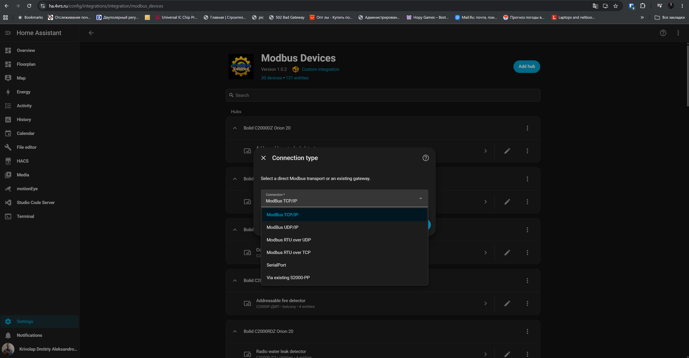

<p align="center">
  
</p>

# Modbus Devices for Home Assistant

[English](README.md) | [Русский](README_RU.md)

Modbus Devices is a local Home Assistant integration for explicitly supported industrial and building-automation equipment. Each physical instrument becomes one Home Assistant device with useful entities, validated communication, and model-specific behavior.

## New in 1.1.0 — climate control

This release introduces the first Home Assistant `climate` entities in Modbus
Devices: **Haier YCJ-A002** and **Daikin RTD-RA**, with dedicated device-card
profiles. It also adds **Modbus RTU over TCP** for transparent RAW TCP gateways.
YCJ-A002 has been hardware-validated in Home Assistant through
[4VRS Gateway](https://github.com/dk-1983/moxa-4vrs-gateway) in RAW TCP mode.

Existing configurations require no migration. Update the integration and restart
Home Assistant. Select the new transport when adding equipment behind a RAW TCP
gateway. Cards remain an optional, manually added dashboard feature.

## Key features

- Modbus TCP/IP, native Modbus UDP/IP, serial Modbus RTU, Modbus RTU over UDP, and Modbus RTU over TCP.
- Explicit equipment models from Bolid, Daikin, Dyna Drive, Haier, Owen, and
  Zuked.
- Direct Modbus devices and equipment connected through supported gateways.
- Bolid S2000-PP, Orion, KDL, DPLS, and S2000R-ARR topologies.
- Model-appropriate climate controls, sensors, binary sensors, switches, and
  buttons.
- Strict response validation and grouped/coordinated polling where appropriate.
- Safe explicit write controls only for equipment with a supported command contract.
- UI-only setup, English/Russian localization, and an optional native card generator.

## Supported transports

| Transport | Typical use |
|---|---|
| Modbus TCP/IP | Native Modbus TCP equipment and gateways |
| Modbus UDP/IP | Native Modbus messages over UDP |
| Serial Modbus RTU | Direct RS-485/serial connections |
| Modbus RTU over UDP | Complete RTU frames carried inside UDP datagrams |
| Modbus RTU over TCP | Complete RTU frames with CRC over a transparent RAW TCP stream, without MBAP |

Native Modbus UDP and RTU-over-UDP use different wire formats. Select the transport that matches the equipment or gateway.

## Supported equipment

Support is model-specific; a listed manufacturer does not imply support for every product or variant.

### Bolid — direct and Orion equipment

| Model | Connection | Main capabilities |
|---|---|---|
| M3000-BB-1020 | Direct Modbus | Binary inputs, relay outputs, device time, and diagnostics |
| С2000-ПП | Direct Modbus gateway | Orion mode/communication, tamper, power diagnostics, and downstream mapping |
| С2000-КПБ | S2000-PP / Orion | Configured output and circuit states with supported control |
| С2000-2 | S2000-PP / Orion | Read-only device, input, and access states |
| С2000-4 | S2000-PP / Orion | Read-only device and configured input states |
| Сигнал-20М | S2000-PP / Orion | Read-only device and configured input states |
| С2000-БКИ | S2000-PP / Orion | Read-only device diagnostic state |
| МИП-24 исп.20 | S2000-PP / Orion | Power states, electrical measurements, battery charge, and tamper |

M3000 device time is read-only in Home Assistant. If its RTC is invalid or differs materially from Home Assistant time, the integration may correct the device RTC automatically through the validated Modbus write path.

### Bolid — wired KDL/DPLS equipment through S2000-PP

| Model | Connection | Main capabilities |
|---|---|---|
| С2000-КДЛ | S2000-PP / Orion | Controller state and DPLS topology |
| ДИП-34А-05 | S2000-PP / DPLS | Smoke-detector state |
| С2000-ИП-03 | S2000-PP / DPLS | Heat-detector state and optional temperature measurement |
| С2000-ДЗ | S2000-PP / DPLS | Water-leak state and moisture detection |
| С2000-СТ исп.04 | S2000-PP / DPLS | Glass-break state, alarm, tamper, and fault diagnostics |
| С2000-СМК исп.04 | S2000-PP / DPLS | Opening state and intrusion indication |
| С2000-ВТ | S2000-PP / DPLS | Temperature, relative humidity, and both channel states |
| С2000-ВТИ | S2000-PP / DPLS | Temperature, relative humidity, and both channel states; isp.01 is not supported |
| С2000-СП4/24(220) | S2000-PP / DPLS | Actuator state and supported control |
| С2000-СП2 | S2000-PP / DPLS | Read-only relay/output state |
| СВК15-3-2-Б | S2000-PP / DPLS | Water-meter state and cumulative water consumption |
| СВК15-3-8-1-Б3 | S2000-PP / DPLS | Water-meter state; automatic counter polling is safety-disabled |

Supported S2000-SP4 variants are `/24`, `/24 isp.01`, `/220`, and `/220 isp.01`; `/220 isp.02` is not supported.

### Bolid — radio equipment represented through KDL/DPLS

| Model | Connection | Main capabilities |
|---|---|---|
| С2000Р-АРР125 | S2000-PP / KDL | Radio-controller state |
| С2000Р-ДИП | S2000-PP / ARR/KDL | Smoke state, enclosure tamper, main/reserve battery diagnostics |
| С2000Р-ИП | S2000-PP / ARR/KDL | Heat state, tamper, main/reserve batteries, measurement fault |
| С2000Р-РМ | S2000-PP / ARR/KDL | Two independent relay controls; optional controlled-circuit state on the standard variant |
| С2000Р-Сирена | S2000-PP / ARR/KDL | Independent light and sound controls |
| С2000Р-СТ исп.01 | S2000-PP / ARR/KDL | Glass-break state/alarm, tamper, and battery diagnostics |
| С2000Р-СМК | S2000-PP / ARR/KDL | Contact state/alarm, tamper, one battery, and optional external-input state |
| С2000Р-ДЗ | S2000-PP / ARR/KDL | Water-leak state, moisture detection, and main/reserve battery diagnostics |
| С2000Р-ВТИ | S2000-PP / ARR/KDL | Temperature, relative humidity, both channel states, and main battery diagnostics |

Some documented Bolid events require matching ARR/KDL/S2000M/PProg/S2000-PP configuration and retransmission. If an entity does not change, first verify that the event is configured to reach S2000-PP; this alone does not prove a device or integration defect.

### Haier

| Model | Connection | Main capabilities |
|---|---|---|
| [YCJ-A002](https://haier-rus.ru/product/ycj-a002-soglasovatel/) | Modbus RTU, including RTU over TCP through a RAW TCP gateway | Power, HVAC mode, target/current temperature, fan mode, and fault/lock diagnostics |

The adapter must be configured for its open Modbus RTU protocol
(BM1: switch 1 OFF, switch 2 ON). The documented defaults are 19200 baud,
8 data bits, no parity, and 1 stop bit. The integration uses the zero-based
addresses printed in the
[official YCJ-A002 installation and operation manual](https://haier-rus.ru/wp-content/uploads/2020/11/instrukcziya_ycj-a002.pdf):

| Data area | Address | Access | Meaning |
|---|---:|---|---|
| Coil | 0 | FC01 / FC05 | Power |
| Holding register | 0 | FC03 / FC06 | Target temperature, 16–30 °C |
| Holding register | 1 | FC03 / FC06 | HVAC mode |
| Holding register | 2 | FC03 / FC06 | Fan mode |
| Holding register | 3 | FC03 | Controller lock state |
| Input register | 0 | FC04 | Room temperature |
| Input register | 1 | FC04 | Fault code |
| Input register | 2 | FC04 | Compatibility unit number |

The generated YCJ-A002 device card contains the primary climate control.
Fault, lock, and raw protocol values remain available as diagnostic attributes.

Hardware validation confirmed successful operation of a physical YCJ-A002 in
Home Assistant using the new RTU-over-TCP transport through 4VRS Gateway RAW TCP
at `10.0.2.13:502`, slave ID `1`. These are the validation setup's settings;
use your own gateway endpoint and device address.

### Daikin

| Model | Connection | Main capabilities |
|---|---|---|
| [RTD-RA](https://www.daikin.eu/en_us/products/product.html/RTD-RA.html) | Direct Modbus RTU | Power, HVAC mode, target/current temperature, five fan speeds, louvre swing, fault status, and coil-inlet temperature |

RTD-RA uses Modbus RTU over three-wire RS-485. Its documented defaults are
9600 baud, no parity, and 1 stop bit. Register references in the
[official RTD-RA installation instructions](https://support.realtime-controls.co.uk/hc/en-us/article_attachments/360007028079)
are already zero-based protocol addresses: H0001 is address 1, not address 0.
The integration uses:

| Manual reference | Address | Access | Meaning |
|---|---:|---|---|
| H0001 | 1 | FC03 / FC06 | Target temperature |
| H0002 | 2 | FC03 / FC06 | Fan mode |
| H0003 | 3 | FC03 / FC06 | HVAC mode |
| H0004 | 4 | FC03 / FC06 | Louvre stop/swing |
| H0005 | 5 | FC03 / FC06 | Power |
| I0121 | 121 | FC04 | Fault active |
| I0122 | 122 | FC04 | Fault code |
| I0123 | 123 | FC04 | Return-air temperature, signed value ×100 |
| I0130 | 130 | FC04 | Thermostat state |
| I0131 | 131 | FC04 | Coil-inlet temperature, signed value ×100 |

The generated RTD-RA device card places the climate control first and the
coil-inlet temperature in its diagnostic section. Configure the RTD-RA
Modbus-master timeout deliberately: the integration does not create artificial
keepalive writes. Installation and operating-mode guidance is also available
from the
[official RTD-RA support page](https://support.realtime-controls.co.uk/hc/en-us/articles/360010965160-How-to-install-the-RTD-RA).

Both models are covered by automated protocol, entity, presentation, and full
regression tests. YCJ-A002 is hardware-validated on the 4VRS RAW TCP setup above;
RTD-RA has not yet been hardware-validated.

### Owen

| Model | Connection | Main capabilities |
|---|---|---|
| ПЛК110-24.60.К-М | Direct Modbus | 36 user-mapped binary inputs and 24 output switches |
| TRM-138 | Direct Modbus | Read-only eight-channel temperature monitoring and diagnostics |

### Zuked

| Model | Connection | Main capabilities |
|---|---|---|
| 310-4.0S1 | Direct Modbus | Read-only AC-drive runtime monitoring and fault diagnostics |

### Dyna Drive

| Model | Connection | Main capabilities |
|---|---|---|
| DN310 | Direct Modbus | Experimental drive monitoring, diagnostics, and explicit command buttons |

## Installation

### HACS (recommended)

Modbus Devices is available in the default HACS integration catalog:

1. Open **HACS → Integrations**.
2. Search for **Modbus Devices**.
3. Install it and restart Home Assistant.
4. Open **Settings → Devices & services → Add integration → Modbus Devices**.

### Manual installation

Copy `custom_components/modbus_devices` into the `custom_components` directory of your Home Assistant configuration, restart Home Assistant, and add **Modbus Devices** from **Devices & services**.

## Adding equipment

Configuration is performed entirely in the Home Assistant UI.

### Option 1 — Direct Modbus device

1. Add **Modbus Devices** and choose **Add a new hub**.
2. Select TCP, UDP, serial RTU, RTU over UDP, or RTU over TCP.
3. Select the manufacturer and exact model.
4. Enter the host/port or serial settings and Modbus unit ID.
5. Finish setup; one Home Assistant device is created for the physical instrument.

<p align="center"></p>

<p align="center"></p>

<p align="center"></p>

<p align="center"></p>

<p align="center"></p>

### Option 2 — Equipment via an existing S2000-PP

Add and verify the S2000-PP gateway first. Then add **Modbus Devices** again and choose **Via existing S2000-PP**.

1. Select the correct S2000-PP gateway.
2. Select the downstream physical model.
3. Enter the KDL Orion address and the device's DPLS base address.
4. Use configuration-assisted mapping when available, or select the PP row manually.
5. Repeat the flow for each additional physical device.

Configuration-assisted mapping reads the selected S2000-PP configuration table and offers compatible unused rows. It does not identify the physical model automatically, so always select the actual model first. If no single compatible mapping is found, manual mapping lets you enter the known zone/relay table row and required capability details; the integration still validates them against the chosen model.

<p align="center"></p>

<p align="center"></p>

<p align="center"></p>

<p align="center"></p>

<p align="center"></p>

The Orion and DPLS addresses identify the physical device; the PP row is its current gateway projection. One physical instrument is represented by one Home Assistant device, even when it provides several entities.

<p align="center"></p>

## Optional device-card generator

1. Edit a dashboard and choose **Add card**.
2. Select **Modbus Device**.
3. Choose the physical device.
4. Review the generated entities and save the card.

<p align="center"></p>

<p align="center"></p>

<p align="center"></p>

<p align="center"></p>

After saving, the result is a standard native Home Assistant `type: entities` card. There is no permanent Modbus Devices runtime wrapper, and the card can be edited normally afterward.

## Architecture

```text
Manufacturer → Equipment model → Transport or gateway → Coordinator
                                                       → HA Device and entities
```

```text
Home Assistant ← Modbus ← S2000-PP ← Orion ← S2000-KDL ← DPLS device
                                                   ↖ S2000R-ARR radio infrastructure
```

## Modbus RTU over TCP (4VRS RAW TCP)

Select **Modbus RTU over TCP** for the transparent RAW TCP transport of a
4VRS Gateway, including Haier YCJ-A002. Enter the gateway host, its configured
RAW TCP port, device ID (1–247), and timeout. The port must match the gateway;
502 in the form is only a default. Serial settings remain configured on the gateway.
The config flow checks TCP connectivity; device polling validates RTU responses.

Requests contain a full RTU ADU with CRC and no MBAP header. The client supports
FC01/02/03/04/05/06/16, assembles fragmented TCP responses, and validates frame
length, CRC, slave, function, byte count, and write acknowledgement fields.
`SerializedModbusClient` remains the shared physical request boundary.

A timeout, cancellation, invalid response, or incomplete EOF closes the stream.
The next independent request reconnects; the failed command is never replayed.
Buffered unsolicited data and coalesced extra frames are rejected. RTU has no
transaction ID: a gateway must not replay old serial responses onto a new TCP
connection, and arbitrarily late identical replies cannot be distinguished from
fresh replies. Use a single master for the serial bus.

Automated TCP-emulator tests cover YCJ-A002 polling and controls. Physical
YCJ-A002 operation with Home Assistant is also confirmed on 4VRS RAW TCP
(`10.0.2.13:502`, slave ID `1`); see [RTU over TCP](docs/rtu_over_tcp.md).
During validation, a displayed `rtu_over_tcp` translation key was caused by the
frontend cache and resolved after refreshing the page. Production configuration
was not changed.

## Modbus RTU over UDP

RTU-over-UDP carries complete Modbus RTU frames, including address and CRC, inside UDP datagrams. It is not native Modbus UDP. Configure the gateway host, UDP port, unit ID, and response timeout; fixed-peer gateways may also require Home Assistant to originate traffic from the expected endpoint.

## Troubleshooting

- Verify host, port, unit ID, and serial parameters against the equipment configuration.
- Confirm that the selected transport matches the gateway; native UDP and RTU-over-UDP are not interchangeable.
- For S2000-PP equipment, verify the model, Orion/DPLS addresses, PP mapping, and Bolid-side event retransmission.
- A timeout, Modbus exception, or malformed response makes affected entities unavailable rather than falsely normal.
- Ensure another application is not holding an exclusive serial port.

## Limitations and boundaries

- Support and entity sets are defined per exact model; similar variants are not assumed compatible.
- A physical feature is exposed only when a truthful path exists through the supported Modbus topology.
- Runtime firmware, serial, radio address, RSSI, and similar metadata are shown only when actually readable.
- Write controls exist only for explicitly supported commands; some equipment is intentionally read-only.
- Zuked 310-4.0S1 provides monitoring only, without motor-control or configuration writes.
- Dyna Drive DN310 remains experimental; verify its profile against the target hardware.

## Development and deep documentation

Equipment implementations are manufacturer- and model-specific. Validation uses focused and regression pytest coverage, Ruff, Hassfest, compilation, and whitespace checks. Detailed protocol decisions, hardware evidence, and device-family audits are in [`docs/`](docs/).

## Project links

- [GitHub repository](https://github.com/dk-1983/Modbus_Devices)
- [Issues](https://github.com/dk-1983/Modbus_Devices/issues)
- [Releases](https://github.com/dk-1983/Modbus_Devices/releases)
- [License](LICENSE.md)
- [Bolid](https://bolid.ru/)
- [Daikin RTD-RA](https://www.daikin.eu/en_us/products/product.html/RTD-RA.html)
- [Dyna Drive](https://www.dninno.com/)
- [Haier YCJ-A002](https://haier-rus.ru/product/ycj-a002-soglasovatel/)
- [Owen](https://owen.ru/)

## Author

[Dmitry Krivolap](https://4vrs.online)
