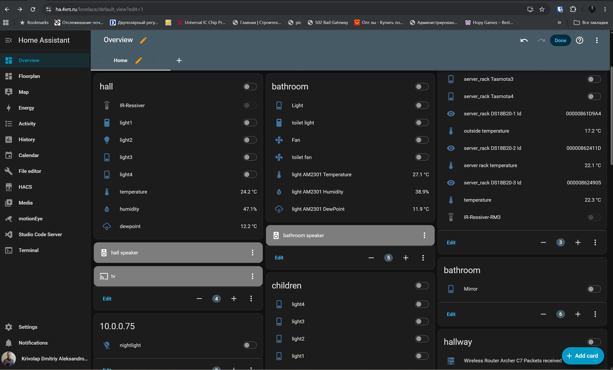
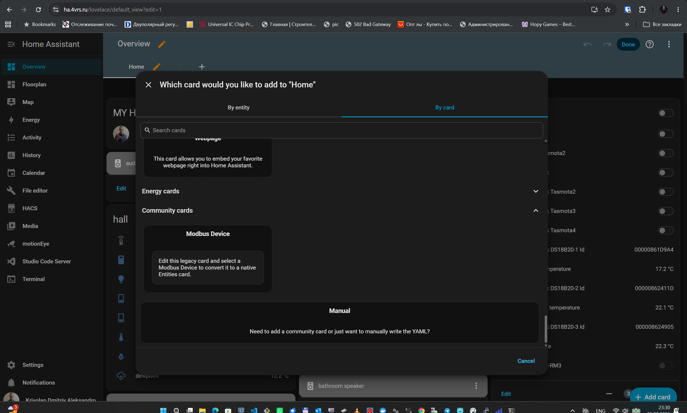
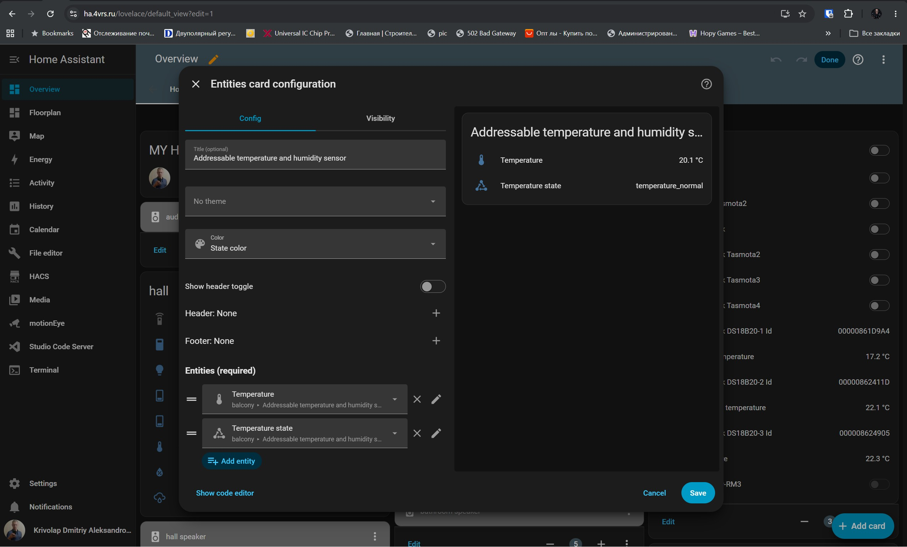
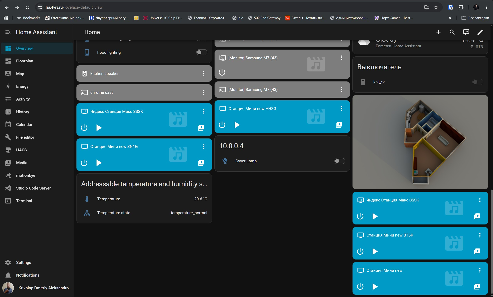

# Modbus Devices for Home Assistant

**[English](README.md) | [Русский](README_RU.md)**

Modbus Devices is a custom Home Assistant integration for explicitly supported industrial and building-automation equipment. Each equipment model defines its own Modbus-visible capabilities, entities, validation rules, and, where required, gateway mapping.

The integration is a local-polling hub for Modbus-compatible equipment from multiple manufacturers, using direct connections or supported gateway/topology mappings. The canonical registry currently contains Bolid, Dyna Drive, and Owen equipment.

## Key features

- Modbus TCP/IP, native Modbus UDP/IP, serial Modbus, and Modbus RTU over UDP connections.
- Equipment-driven creation of sensor, binary sensor, switch, and button entities.
- Typed equipment variants and topology-dependent capabilities.
- С2000-ПП gateway support for Orion, С2000-КДЛ, and downstream DPLS equipment.
- Manual and configuration-assisted gateway mapping.
- Authoritative multistate Orion values with primary, expanded, and raw state codes.
- Documented numeric measurements, including temperature and humidity where the С2000-ПП path supports them.
- Relay/output control with validated writes, optimistic synchronization, and protection from stale poll results.
- Explicit communication and malformed-response error handling: failures are not reported as normal or off states.
- Centralized coordinator polling, grouped reads where possible, serialized requests per client, and strict common response validation.
- Backward-compatible loading of legacy Config Entries while presenting canonical manufacturer and model names.

Support is model-specific. Selecting a manufacturer does not imply support for every device or every physical function from that manufacturer.

## What's new in 0.5.0

- С2000-ПП downstream equipment is represented as separate physical Home Assistant Devices with the gateway recorded as their parent.
- The physical-device presentation model provides consistent entity discovery, ordering, and clean row names across supported manufacturers.
- The optional **Modbus Device** card generator prepares a standard Home Assistant Entities card for one selected physical device.
- Card generation works through the same manufacturer-neutral presentation path for direct Bolid equipment, Bolid equipment behind С2000-ПП, Owen equipment, and future registered manufacturers.

Version 0.5.0 is a substantial pre-1.0 architecture and workflow milestone. Existing entities remain normal Home Assistant entities and do not require the optional card generator.

## What's new in 0.5.1

- M3000-BB-1020 polling now reads its documented device-information and clock block in one request, validates protocol responses more strictly, and keeps a drifting or invalid device clock synchronized to Home Assistant time.
- The former writable M3000 **Clock** datetime entity is removed during setup and replaced by a read-only **Device time** sensor. Automations or dashboards that used the old datetime entity must be updated.
- TRM-138 polling now reads all eight documented FC04 measurement blocks in one coherent request and validates signed values, decimal scaling, IEEE-754 words, and per-channel device status.

These changes do not add M3000 pulse-counter, PWM, relay-logic, safe-state, network-configuration, service-command, or packed-register capabilities. TRM-138 remains read-only: output control, regulator settings, and configuration/service writes are not exposed.

## Supported transports

| Transport | Configuration |
|---|---|
| Modbus TCP/IP | Host, port, and Modbus unit ID |
| Modbus UDP/IP | Host, port, and Modbus unit ID |
| Serial Modbus RTU | Serial port, baud rate, byte size, parity, stop bits, and unit ID |
| Modbus RTU over UDP | Remote host/port, fixed local UDP port, timeout, optional local bind address, and downstream device ID |

Native Modbus UDP/IP and Modbus RTU over UDP are different wire protocols. Native UDP carries Modbus application framing over UDP. RTU over UDP carries a raw Modbus RTU ADU, including its CRC, inside a UDP datagram and does not use an MBAP header.

Transport support still depends on the selected equipment and its physical interface.

## Supported equipment

The canonical registry in the current source tree contains **30 models: Bolid 27, Dyna Drive 1, and Owen 2**. Model names below are user-facing manufacturer names, not Python class keys.

### Bolid — direct Modbus and С2000-ПП gateway

| Manufacturer | Model | Connection / gateway | Home Assistant entities / capabilities | Notes |
|---|---|---|---|---|
| Bolid | [M3000-BB-1020](https://bolid.ru/production/disp/inout-modules/m3000_vv_1020.html) | Direct Modbus | 12 binary inputs, 6 relay switches, read-only device-time sensor | Device information and clock are read together; Home Assistant time corrects invalid or drifting device time. Pulse counters, PWM, relay logic, safe states, network configuration, and service commands are not exposed |
| Bolid | [С2000-ПП](https://bolid.ru/production/s2000-pp.html) | Direct Modbus | Gateway diagnostic binary sensors | Orion master mode/communication, enclosure tamper, and power fault; device service information where exposed |
| Bolid | С2000-КПБ | С2000-ПП → Orion | Configured output switches and multistate sensors | Up to 6 outputs/circuit states, 2 technological inputs, and device state; entities follow the configured subset |
| Bolid | С2000-2 | С2000-ПП → Orion | Read-only device and configured input/access states | Direct Orion model; no door-control commands are published |
| Bolid | С2000-4 | С2000-ПП → Orion | Read-only device state and up to four configured input states | Relay control is intentionally not published |
| Bolid | Сигнал-20М | С2000-ПП → Orion | Read-only device state and up to 20 configured input states | This class does not cover Сигнал-20П, Сигнал-20П исп.01, or Сигнал-20 сер.04 |
| Bolid | С2000-БКИ | С2000-ПП → Orion | Read-only diagnostic state of the unit itself | External partitions/indicators are not duplicated; С2000-БКИ 2RS485 is not covered by this class |
| Bolid | [МИП-24 исп.20](https://bolid.ru/production/mip-24_20.html) | С2000-ПП / Orion RS-485 | Device, output power, output load, battery, charger, and mains multistate sensors | Full designation МИП-24-2/П5-Р-RS; device state is required and the other five states follow the configured mapping subset; physical numeric measurements are not exposed because their current С2000-ПП Modbus path is not confirmed |

### Bolid — С2000-КДЛ and wired DPLS equipment

| Manufacturer | Model | Connection / gateway | Home Assistant entities / capabilities | Notes |
|---|---|---|---|---|
| Bolid | [С2000-КДЛ](https://bolid.ru/production/s2000-kdl.html) | С2000-ПП → Orion | Multistate diagnostic sensor | Only the controller-owned type-3/local-0 state; downstream rows remain separate devices |
| Bolid | ДИП-34А-05 | С2000-ПП → С2000-КДЛ → DPLS | Operational multistate detector state | One DPLS address; no synthetic smoke/dust sensors |
| Bolid | С2000-ИП-03 | С2000-ПП → С2000-КДЛ → DPLS | Multistate detector state; optional temperature sensor | Type-1 state-only or type-6 state-and-temperature mapping; both modes use one DPLS identity |
| Bolid | [С2000-ДЗ](https://bolid.ru/production/s_2000_dz.html) | С2000-ПП → С2000-КДЛ → DPLS | Multistate water-leak state | Static variants 1.06, 1.10, and 1.13; no derived moisture binary sensor |
| Bolid | [С2000-СТ исп.04](https://bolid.ru/production/s2_st_04.html) | С2000-ПП → С2000-КДЛ → DPLS | Operational glass-break multistate state | Wired one-address DPLS detector; DPLS service voltage is not exposed as a numeric entity through the current С2000-ПП path |
| Bolid | [С2000-СМК](https://bolid.ru/production/amrs/addr-amrs-detection-hdw/) | С2000-ПП → С2000-КДЛ → DPLS | Opening multistate state | Wired one-address model; discontinued by the manufacturer but documented and supported by the integration |
| Bolid | С2000-ВТ / С2000-ВТ исп.01 | С2000-ПП → С2000-КДЛ → DPLS | Temperature and relative-humidity sensors | Numeric values use the documented С2000-ПП numeric request lifecycle |
| Bolid | С2000-ВТИ / С2000-ВТИ исп.01 | С2000-ПП → С2000-КДЛ → DPLS | No currently available entities through this path | Models are registered, but numeric transport through the current С2000-ПП path is not confirmed and configuration is blocked |
| Bolid | [С2000-СП4/24(220)](https://bolid.ru/production/s2000-sp4.html) | С2000-ПП → С2000-КДЛ → DPLS | Configured actuator switch and multistate position/circuit sensors | Supported variants are listed below; entities follow the configured mapping subset |
| Bolid | С2000-СП2 | С2000-ПП → С2000-КДЛ → DPLS | Read-only relay-state representation | One- or two-output topology; no control entities. This class does not claim исп.02 or исп.03 |
| Bolid | СВК15-3-2-Б | С2000-ПП → С2000-КДЛ → DPLS | Water-meter state/count data exposed by the implemented mapping | Exact registered model only |
| Bolid | СВК15-3-8-1-Б3 | С2000-ПП → С2000-КДЛ → DPLS | Water-meter state/count data exposed by the implemented mapping | Exact registered model only |

Supported С2000-СП4 variants:

- С2000-СП4/24
- С2000-СП4/24 исп.01
- С2000-СП4/220
- С2000-СП4/220 исп.01

**С2000-СП4/220 исп.02 is not supported.**

### Bolid — radio equipment represented as DPLS objects

| Manufacturer | Model | Connection / gateway | Home Assistant entities / capabilities | Notes |
|---|---|---|---|---|
| Bolid | [С2000Р-АРР125](https://bolid.ru/production/s2r_arr125.html) | С2000-ПП → С2000-КДЛ → DPLS | Aggregate multistate expander state | Hardware variants 1.0 and 14.0; enrolled radio devices are not owned by this equipment model |
| Bolid | С2000Р-ДИП | С2000-ПП → С2000-КДЛ → DPLS | Operational multistate detector/radio state | Battery, tamper, and communication conditions remain multistate values; no RSSI entity |
| Bolid | С2000Р-ИП | С2000-ПП → С2000-КДЛ → DPLS | Operational multistate detector/radio state | Physical temperature capability exists, but numeric temperature through the current PP path is not confirmed |
| Bolid | С2000Р-РМ / С2000Р-РМ исп.01 | С2000-ПП → С2000-КДЛ → DPLS | Two independent relay switches; optional controlled-circuit state | Standard variant supports two-output or two-output-plus-input topology; исп.01 is outputs-only |
| Bolid | С2000Р-Сирена | С2000-ПП → С2000-КДЛ → DPLS | Independent Light and Sound switches | No combined switch, pattern, duration, or radio-service controls |
| Bolid | [С2000Р-СТ исп.01](https://bolid.ru/production/s2000r-st_01.html) | С2000-ПП → С2000-КДЛ → DPLS via С2000Р-АРР125 | Operational glass-break multistate state | Battery, tamper, and radio communication remain Orion multistate semantics; no RSSI entity |
| Bolid | [С2000Р-СМК](https://bolid.ru/production/s2000r_smk.html) | С2000-ПП → С2000-КДЛ → DPLS via С2000Р-АРР125 | Opening multistate state; optional External input multistate state | Uses one or two DPLS addresses according to the configured topology; no derived opening binary sensor |

### Dyna Drive — direct Modbus equipment

| Manufacturer | Model | Connection / gateway | Home Assistant entities / capabilities | Notes |
|---|---|---|---|---|
| Dyna Drive | DN310 | Direct Modbus | Read-only runtime diagnostics, running state, fault decoding, and command buttons | Implemented commands: Forward run, Reverse run, Coast stop, Decelerate stop, and Fault reset. Writable frequency setpoint and jog are not implemented; the integration does not automatically modify persistent drive parameters |

The DN310 implementation is registered and covered by repository tests, but complete hardware and register-map validation is still in progress. Treat current support as experimental until it has been verified against authoritative manufacturer documentation and physical hardware.

### Owen — direct Modbus equipment

| Manufacturer | Model | Connection / gateway | Home Assistant entities / capabilities | Notes |
|---|---|---|---|---|
| Owen | [TRM-138](https://owen.ru/product/trm138) | Direct Modbus | 8 read-only measurement channels | One coherent FC04 snapshot covers all channels; signed and scaled values and channel status are validated. The `T` suffix denotes a transistor-output family variant, not a different measurement register map; output, regulator, and configuration writes are not exposed |
| Owen | [ПЛК110-24.60.К-М](https://files.owen.ru/catalog/product.php?cat=plc&prod=plk110_m02&sub=programmiruemie_logicheskie_kontrolleri) | Direct Modbus | 36 binary inputs and 24 output switches | User-defined CODESYS Modbus bit layout; configurable DI area, base/stride, and DO base/stride |

## Equipment examples

The photographs below are local, optimized copies from official manufacturer product pages. They illustrate representative architecture and DPLS equipment rather than every supported variant.

<p align="center">
  
  
  
</p>
<p align="center">
  
  
</p>

## Installation

Modbus Devices is listed in the default HACS integration catalog. Manual installation remains available when HACS is not used.

### HACS

1. Open HACS and search for **Modbus Devices**.
2. Download the integration.
3. Restart Home Assistant.
4. Add **Modbus Devices** through **Settings → Devices & services**.

If the integration does not appear in search, refresh HACS data first. Adding `https://github.com/dk-1983/Modbus_Devices` as a custom repository in the **Integration** category is a fallback, not normally required.

Published packages and version history are available on the [Releases page](https://github.com/dk-1983/Modbus_Devices/releases).

### Manual installation

Copy:

```text
custom_components/modbus_devices
```

to:

```text
/config/custom_components/modbus_devices
```

Restart Home Assistant and add **Modbus Devices** through **Settings → Devices & services**.

## Adding equipment

Configuration is UI-only. Open **Settings → Devices & services → Modbus Devices** and select **Add hub**. There are two distinct paths:

- choose a Modbus transport for a device with its own direct connection;
- choose **Via existing S2000-PP** for Bolid equipment reached through a С2000-ПП that has already been added and is currently loaded.

### Option 1 — Direct Modbus device

Use this path when the equipment has its own Modbus connection.

1. Select **ModBus TCP/IP**, **ModBus UDP/IP**, **Modbus RTU over UDP**, or **SerialPort**.
2. Select the manufacturer and the physical equipment model.
3. Enter the network or serial settings, Modbus unit/device ID, and a name.
4. Complete any model-specific fields and submit the flow.

<p align="center"></p>

<p align="center"></p>

<p align="center"></p>

<p align="center"></p>

Home Assistant then creates the Device and the entity set implemented for that model.

<p align="center"></p>

For directly connected equipment, setup is now complete. If Bolid equipment is reached through an Orion/DPLS network and С2000-ПП, use the second path instead.

### Option 2 — Equipment via existing С2000-ПП

This path creates a separate Home Assistant Device for each supported Bolid instrument behind an existing С2000-ПП.

#### Step 1 — Add the С2000-ПП gateway once

**Via existing S2000-PP is available only when at least one direct С2000-ПП Config Entry is loaded.** Add the gateway like a normal direct device:

1. Select **Add hub** and choose the transport physically connected to the С2000-ПП.
2. Select **Bolid → С2000-ПП**.
3. Enter that gateway's Serial/TCP/UDP settings and Modbus unit ID.
4. Finish the flow and make sure the С2000-ПП entry is loaded rather than unavailable.

This entry owns the physical Modbus client and represents the gateway itself, including its diagnostic entities.

#### Steps 2–5 — Add and identify a downstream device

1. Select **Add hub** again and choose **Via existing S2000-PP**.

<p align="center"></p>

Confirm the selected connection type to open the gateway picker.

<p align="center"></p>

2. Select the required gateway. The list contains loaded direct С2000-ПП entries, so each downstream device can be attached to the correct physical gateway when several are installed.

<p align="center"></p>

3. Select the physical downstream Bolid model. Only models supported through С2000-ПП are offered.

<p align="center"></p>

4. For DPLS equipment, select its variant/topology where offered and enter its identity:

   - **KDL Orion address** is the Orion network address (1–127) of the С2000-КДЛ controller to which the device belongs. It is not the Modbus unit ID of the С2000-ПП.
   - **DPLS base address** is the first DPLS address (1–127) occupied by the device on that KDL loop. A one-address device uses only this address; a multi-address topology reserves the required consecutive addresses beginning here.

For example, a sensor at DPLS address 5 on a С2000-КДЛ whose Orion address is 12 uses **KDL Orion address = 12** and **DPLS base address = 5**.

<p align="center"></p>

For an Orion device that is not behind a KDL/DPLS loop, **Orion address** means that device's own address on the Orion RS-485 network; no DPLS address is requested.

5. Select the mapping source and finish either configuration-assisted or manual mapping as described below.

#### Step 6A — Configuration-assisted mapping

Automatic/configuration-assisted mapping reads the zone and relay configuration tables from the selected С2000-ПП and offers suitable discovered mappings. The user explicitly selects the required discovered object; nothing is silently imported. Objects already added through this gateway are excluded from the choices, while the remaining objects can be added later by repeating the flow.

After the address is selected, the integration filters the table rows using the selected model, identity, variant/topology, and exact capability rules. Setup succeeds only when one valid mapping is found. If nothing matches or several mappings are possible, correct the С2000-ПП configuration or use manual mapping.

This is configuration discovery, **not physical hardware discovery**: С2000-ПП tables do not reliably identify every physical model. The user must always select the actual downstream equipment model. Read tables are cached and are not fetched on every normal poll.

#### Step 6B — Manual mapping

Manual mapping is useful when discovery cannot produce one exact result or when you already know the С2000-ПП table numbers. Enter the Orion address when requested, then map each required equipment capability to its configured С2000-ПП zone/relay table row. Some models use the detailed form with object kind, local object number, table number, zone type, and partition values; capability-based models ask for a capability and its table number. The integration still validates the completed mapping against the selected model.

<p align="center"></p>

#### Step 7 — Add more downstream devices

A downstream Config Entry does **not** need or accept separate Serial/TCP/UDP settings. It stores a reference to the selected С2000-ПП entry and shares that gateway's already-open, serialized Modbus client. Add each downstream device with **Add hub → Via existing S2000-PP**, select the same gateway, and give it its own Orion/DPLS identity and mapping.

This creates separate Home Assistant Devices and entities while all requests travel through one С2000-ПП connection. Unloading a child does not close the gateway connection; unloading or removing the gateway makes its children unavailable until the gateway is loaded again.

<p align="center"></p>

Config Flow is localized in English and Russian. Internal class names and register addresses are not normal inputs, and YAML configuration is not supported.

## Optional: Generate a device card

If you want, Modbus Devices can automatically prepare a standard Home Assistant Entities card for a selected physical device. This is an optional dashboard convenience feature, not part of Config Flow and not required to use the integration. You can place Modbus Devices entities on dashboards or use them in automations and scripts through any standard Home Assistant workflow.

A physical device can expose several related entities—temperature, humidity, states, outputs, channels, or diagnostics. When they are added manually, they can become visually scattered across a dashboard, especially at different screen widths. The generator quickly collects the entities of one physical Device into one standard card, using the existing semantic ordering and clean naming logic.

1. Open the desired dashboard in edit mode and select **Add card**.

<p align="center"></p>
<p align="center"><em>Open dashboard edit mode and start adding a card.</em></p>

2. Choose **Modbus Device** in the Home Assistant card picker, then select one physical Device belonging to the Modbus Devices integration.

<p align="center"></p>
<p align="center"><em>The Modbus Device entry opens the optional physical-device generator.</em></p>

3. The integration discovers the current entities of that Device and hands a complete native configuration to the standard Home Assistant Entities card editor. Review the title, rows, ordering, and preview; you can edit them with the normal Home Assistant controls before saving.

<p align="center"></p>
<p align="center"><em>The generated result is already open in the native Entities card editor.</em></p>

4. Save the card normally.

<p align="center"></p>
<p align="center"><em>The finished card is an ordinary Home Assistant card on the regular dashboard.</em></p>

After saving, Lovelace stores a native `type: entities` card with its current entity list. There is no permanent custom renderer, separate Modbus Devices dashboard, or automatic Area/Sections layout. The same generator works for supported direct Bolid devices, Bolid devices reached through С2000-ПП, Owen devices, and future manufacturers registered with the presentation framework.

The saved list is intentionally static. If the physical device later gains a capability or a previously disabled entity is enabled, an existing card does not have to add a new row automatically. Edit the native card manually or run **Add card → Modbus Device** again to generate a fresh card.

## Architecture

```text
Manufacturer
  → Equipment model
    → Transport or gateway
      → Resolved mapping
        → Coordinator snapshot
          → Home Assistant Device and entities
```

Direct equipment is polled over its configured Modbus connection. Gateway-backed Bolid equipment uses an additional mapping layer that separates a physical device identity from the С2000-ПП table rows used to read or control it.

### Bolid Orion and DPLS path

```text
Home Assistant
  ← Modbus
    ← С2000-ПП
      ← Orion
        ← С2000-КДЛ
          ← DPLS device
```

Radio devices remain individual KDL-visible DPLS objects:

```text
radio device ↔ С2000Р-АРР125
             → KDL-visible DPLS object
             → С2000-КДЛ
             → С2000-ПП
             → Home Assistant
```

The radio expander is not added to a radio device's stable identity. Within one gateway, a downstream identity is based on the KDL Orion address and the device's DPLS address.

Home Assistant Device Registry also records the physical topology. Each downstream instrument remains its own Device, and its entities belong to that Device; the Device page shows that it is connected through the corresponding С2000-ПП. Identical downstream addresses behind different gateways remain separate. Directly connected devices do not receive an artificial parent.

## Modbus RTU over UDP

This production transport supports FC01, FC02, FC03, FC04, FC05, FC06, and FC16. It uses one persistent UDP socket, a fixed local UDP port, split-datagram accumulation, timeout handling, CRC validation, and source/slave/function validation. Requests pass through the same per-client serialization layer as the other transports.

Example (use values from your gateway configuration):

```text
Transport: Modbus RTU over UDP
Remote host: 192.0.2.10
Remote UDP port: 40000
Local UDP port: 40000
Timeout: 3 seconds
Local bind address: 0.0.0.0 (optional)
Downstream device ID: 1
```

For a gateway with a static UDP peer, the local UDP port must match the destination peer port configured in the gateway. С2000-Ethernet can be used as a prospective transport gateway in Transparent mode, with compatibility set to “Other devices” and a suitable UDP peer configuration. It is not an equipment class: the Home Assistant Device represents the downstream Modbus equipment.

RTU-over-UDP is implemented and covered by automated tests. Live packet capture has verified correct transmission of a raw RTU frame. End-to-end response validation through С2000-Ethernet is still pending confirmation of the gateway configuration; full hardware compatibility is therefore not yet claimed.

## Troubleshooting

- **Cannot connect:** verify host/port or serial device availability, firewall/routing, and that the selected transport matches the gateway protocol.
- **Wrong device ID:** use the downstream Modbus slave/unit ID, not an unrelated gateway address.
- **UDP mismatch:** native Modbus UDP/IP is not raw RTU over UDP; select the mode matching the actual framing.
- **RTU-over-UDP static peer:** make the configured gateway destination port equal to the integration's local UDP port and verify the optional bind address belongs to the Home Assistant host.
- **Serial connection:** verify baud rate, byte size, parity, stop bits, wiring, and slave ID.
- **Entity unavailable after a response:** a timeout, malformed frame, wrong source/slave/function, CRC error, or invalid payload is rejected deliberately. Fix the transport/device configuration; do not disable validation.

## Limitations and boundaries

- Configuration-assisted mapping is a lookup of configured С2000-ПП rows, not hardware discovery.
- Gateway visibility determines what Home Assistant can expose; a physical device capability may exist without a documented Modbus path.
- Serial number, firmware, hardware revision, protocol information, radio identifier, RSSI, voltage, and other service values are exposed only when the current transport actually provides them.
- Radio numeric values are implemented only when current С2000-ПП documentation confirms their transport path.
- Device variants are not assumed compatible merely because their names or enclosures are similar.
- Some Bolid relay controls are intentionally read-only where ownership or tactic safety cannot be established.
- DN310 support is experimental while full hardware and authoritative register-map validation remains in progress; writable frequency setpoint and jog are not implemented.
- С2000-Ethernet RTU-over-UDP receive/end-to-end validation is still pending.
- New equipment models are added after checking current official manuals, protocol descriptions, register maps, and compatibility information.

Modbus Devices exposes write controls only where command semantics are explicitly implemented. Physical relay presence alone does not make an output writable in Home Assistant.

## Development

Equipment implementations live in `custom_components/modbus_devices/equipment/<manufacturer>.py`.

```text
equipment class
  → model capabilities and variants
    → direct I/O or gateway mappings
      → entity descriptions and snapshots
        → focused and regression tests
```

One physical model is normally represented by one equipment class. Small reusable bases provide common protocol mechanics without merging distinct physical devices. Changes should preserve persisted Config Entries, stable device identifiers, entity unique IDs, and existing mapping serialization whenever possible.

The runtime uses typed `entry.runtime_data`, coordinator-owned polling, grouped reads where supported, a `SerializedModbusClient` per connection, common strict Modbus response validation, and explicit manufacturer/equipment registries.

## Validation and quality

Project changes are checked with:

- pytest, including focused equipment and regression coverage;
- Home Assistant Hassfest integration validation;
- Ruff correctness checks;
- Python bytecode compilation and Git whitespace checks.

No fixed test count is documented because the suite grows with supported equipment.

## Project links

- [Source repository](https://github.com/dk-1983/Modbus_Devices)
- [Issues](https://github.com/dk-1983/Modbus_Devices/issues)
- [Releases](https://github.com/dk-1983/Modbus_Devices/releases)
- [Bolid](https://bolid.ru/)
- [Dyna Drive](https://www.dninno.com/)
- [Owen](https://owen.ru/)
- [License](LICENSE.md)

## Author

[Dmitry Krivolap](https://4vrs.online)
