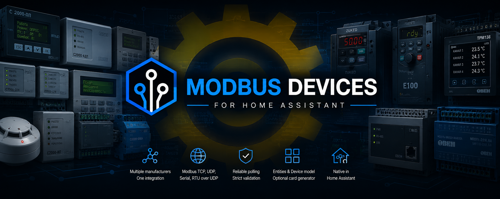

<p align="center">
  
</p>

# Modbus Devices для Home Assistant

[English](README.md) | [Русский](README_RU.md)

Modbus Devices — локальная интеграция Home Assistant для явно поддерживаемого промышленного и инженерного оборудования. Каждый физический прибор представлен отдельным устройством Home Assistant с полезными сущностями, проверкой обмена и поведением конкретной модели.

## Основные возможности

- Modbus TCP/IP, native Modbus UDP/IP, последовательный Modbus RTU и Modbus RTU over UDP.
- Явно описанные модели оборудования Bolid, Owen, Zuked и Dyna Drive.
- Прямые Modbus-подключения и оборудование за поддерживаемыми шлюзами.
- Топологии Bolid С2000-ПП, Orion, КДЛ, ДПЛС и С2000Р-АРР.
- Датчики, бинарные датчики, переключатели и кнопки в соответствии с моделью.
- Строгая проверка ответов, групповой и координированный опрос там, где он уместен.
- Безопасное явное управление только для оборудования с поддерживаемым протоколом команд.
- Настройка через интерфейс, локализация на русском/английском и генератор стандартной карточки Home Assistant.

## Поддерживаемые подключения

| Подключение | Типичное применение |
|---|---|
| Modbus TCP/IP | Оборудование и шлюзы с native Modbus TCP |
| Modbus UDP/IP | Native Modbus-сообщения поверх UDP |
| Последовательный Modbus RTU | Прямые подключения RS-485/COM |
| Modbus RTU over UDP | Полные RTU-кадры внутри UDP-датаграмм |

Native Modbus UDP и RTU-over-UDP используют разные форматы данных. Выбирайте подключение, соответствующее прибору или шлюзу.

## Поддерживаемое оборудование

Поддержка определяется конкретной моделью: наличие производителя в списке не означает совместимость со всеми его приборами и исполнениями.

### Bolid — прямое подключение и оборудование Orion

| Модель | Подключение | Основные возможности |
|---|---|---|
| M3000-BB-1020 | Прямой Modbus | Дискретные входы, релейные выходы, часы и диагностика |
| С2000-ПП | Прямой Modbus-шлюз | Режим/связь Orion, вскрытие, питание и привязка подчинённого оборудования |
| С2000-КПБ | С2000-ПП / Orion | Настроенные состояния выходов и цепей, поддерживаемое управление |
| С2000-2 | С2000-ПП / Orion | Состояния прибора, входов и доступа только для чтения |
| С2000-4 | С2000-ПП / Orion | Состояния прибора и настроенных входов только для чтения |
| Сигнал-20М | С2000-ПП / Orion | Состояния прибора и настроенных входов только для чтения |
| С2000-БКИ | С2000-ПП / Orion | Диагностическое состояние прибора только для чтения |
| МИП-24 исп.20 | С2000-ПП / Orion | Состояния питания, электрические измерения, заряд батареи и вскрытие |

Время M3000 доступно в Home Assistant только для чтения. Если часы прибора содержат недопустимое время или существенно расходятся со временем Home Assistant, интеграция может автоматически скорректировать их через проверенную команду Modbus.

### Bolid — проводное оборудование КДЛ/ДПЛС через С2000-ПП

| Модель | Подключение | Основные возможности |
|---|---|---|
| С2000-КДЛ | С2000-ПП / Orion | Состояние контроллера и топология ДПЛС |
| ДИП-34А-05 | С2000-ПП / ДПЛС | Состояние дымового извещателя |
| С2000-ИП-03 | С2000-ПП / ДПЛС | Состояние теплового извещателя и дополнительное измерение температуры |
| С2000-ДЗ | С2000-ПП / ДПЛС | Состояние протечки и обнаружение влаги |
| С2000-СТ исп.04 | С2000-ПП / ДПЛС | Разбитие стекла, тревога, вскрытие и неисправность |
| С2000-СМК исп.04 | С2000-ПП / ДПЛС | Состояние открытия и тревожная индикация |
| С2000-ВТ | С2000-ПП / ДПЛС | Температура, относительная влажность и состояния обоих каналов |
| С2000-ВТИ | С2000-ПП / ДПЛС | Температура, относительная влажность и состояния обоих каналов; исп.01 не поддерживается |
| С2000-СП4/24(220) | С2000-ПП / ДПЛС | Состояние привода и поддерживаемое управление |
| С2000-СП2 | С2000-ПП / ДПЛС | Состояние выходов/реле только для чтения |
| СВК15-3-2-Б | С2000-ПП / ДПЛС | Состояние водосчётчика и накопленный расход воды |
| СВК15-3-8-1-Б3 | С2000-ПП / ДПЛС | Состояние водосчётчика; автоматический опрос счётчика отключён по безопасности |

Поддерживаются исполнения С2000-СП4 `/24`, `/24 исп.01`, `/220` и `/220 исп.01`; `/220 исп.02` не поддерживается.

### Bolid — радиоустройства, представленные через КДЛ/ДПЛС

| Модель | Подключение | Основные возможности |
|---|---|---|
| С2000Р-АРР125 | С2000-ПП / КДЛ | Состояние радиоконтроллера |
| С2000Р-ДИП | С2000-ПП / АРР/КДЛ | Дым, вскрытие корпуса, диагностика основной и резервной батарей |
| С2000Р-ИП | С2000-ПП / АРР/КДЛ | Тепловое состояние, вскрытие, две батареи, неисправность измерительного канала |
| С2000Р-РМ | С2000-ПП / АРР/КДЛ | Два независимо управляемых реле; состояние контролируемой цепи для стандартного исполнения |
| С2000Р-Сирена | С2000-ПП / АРР/КДЛ | Независимое управление светом и звуком |
| С2000Р-СТ исп.01 | С2000-ПП / АРР/КДЛ | Разбитие стекла/тревога, вскрытие и диагностика батареи |
| С2000Р-СМК | С2000-ПП / АРР/КДЛ | Контакт/тревога, вскрытие, одна батарея и дополнительное состояние внешнего входа |
| С2000Р-ДЗ | С2000-ПП / АРР/КДЛ | Состояние протечки, обнаружение влаги и диагностика основной/резервной батарей |
| С2000Р-ВТИ | С2000-ПП / АРР/КДЛ | Температура, относительная влажность, состояния обоих каналов и основной батареи |

Некоторые документированные события Bolid требуют соответствующей настройки и ретрансляции в АРР/КДЛ/С2000М/PProg/С2000-ПП. Если сущность не меняется, сначала проверьте передачу события до С2000-ПП: само по себе это не доказывает неисправность прибора или интеграции.

### Owen

| Модель | Подключение | Основные возможности |
|---|---|---|
| ПЛК110-24.60.К-М | Прямой Modbus | 36 настраиваемых дискретных входов и 24 управляемых выхода |
| TRM-138 | Прямой Modbus | Восьмиканальный контроль температуры и диагностика только для чтения |

### Zuked

| Модель | Подключение | Основные возможности |
|---|---|---|
| 310-4.0S1 | Прямой Modbus | Чтение рабочих параметров преобразователя и диагностика ошибок без управления |

### Dyna Drive

| Модель | Подключение | Основные возможности |
|---|---|---|
| DN310 | Прямой Modbus | Экспериментальный мониторинг, диагностика и явные командные кнопки |

## Установка

### HACS (рекомендуется)

Modbus Devices доступна в стандартном каталоге интеграций HACS:

1. Откройте **HACS → Интеграции**.
2. Найдите **Modbus Devices**.
3. Установите интеграцию и перезапустите Home Assistant.
4. Откройте **Настройки → Устройства и службы → Добавить интеграцию → Modbus Devices**.

### Ручная установка

Скопируйте `custom_components/modbus_devices` в каталог `custom_components` конфигурации Home Assistant, перезапустите Home Assistant и добавьте **Modbus Devices** в разделе **Устройства и службы**.

## Добавление оборудования

Вся настройка выполняется через интерфейс Home Assistant.

### Вариант 1 — прямое Modbus-устройство

1. Добавьте **Modbus Devices** и выберите **Добавить новый хаб**.
2. Выберите TCP, UDP, последовательный RTU или RTU over UDP.
3. Выберите производителя и точную модель.
4. Укажите адрес/порт либо параметры последовательного соединения и Modbus Unit ID.
5. Завершите настройку; для физического прибора будет создано одно устройство Home Assistant.

<p align="center"></p>

<p align="center"></p>

<p align="center"></p>

<p align="center"></p>

<p align="center"></p>

### Вариант 2 — оборудование через существующий С2000-ПП

Сначала добавьте и проверьте шлюз С2000-ПП. Затем снова добавьте **Modbus Devices** и выберите **Через существующий С2000-ПП**.

1. Выберите нужный шлюз С2000-ПП.
2. Выберите физическую модель подчинённого прибора.
3. Укажите адрес КДЛ в Orion и базовый адрес ДПЛС прибора.
4. Используйте привязку по конфигурации, если она доступна, либо выберите строку ПП вручную.
5. Повторите процедуру для каждого дополнительного физического устройства.

Привязка по конфигурации читает таблицу выбранного С2000-ПП и предлагает совместимые незанятые строки. Физическая модель при этом не определяется автоматически — всегда сначала выбирайте фактический прибор. Если единственная совместимая строка не найдена, ручная привязка позволяет указать известную строку таблицы зон/реле и необходимые возможности; интеграция всё равно проверяет их для выбранной модели.

<p align="center"></p>

<p align="center"></p>

<p align="center"></p>

<p align="center"></p>

<p align="center"></p>

Адреса Orion и ДПЛС идентифицируют физический прибор, а строка ПП является его текущим представлением в шлюзе. Один физический прибор представлен одним устройством Home Assistant, даже если у него несколько сущностей.

<p align="center"></p>

## Необязательный генератор карточки устройства

1. Перейдите в режим редактирования панели и выберите **Добавить карточку**.
2. Выберите **Modbus Device**.
3. Выберите физическое устройство.
4. Проверьте созданный список сущностей и сохраните карточку.

<p align="center"></p>

<p align="center"></p>

<p align="center"></p>

<p align="center"></p>

После сохранения результат является обычной стандартной карточкой Home Assistant `type: entities`. Постоянной обёртки Modbus Devices нет, карточку можно редактировать как обычно.

## Архитектура

```text
Производитель → Модель оборудования → Подключение или шлюз → Координатор
                                                           → Устройство и сущности HA
```

```text
Home Assistant ← Modbus ← С2000-ПП ← Orion ← С2000-КДЛ ← устройство ДПЛС
                                                   ↖ радиооборудование С2000Р-АРР
```

## Modbus RTU over UDP

RTU-over-UDP передаёт полные кадры Modbus RTU, включая адрес и CRC, внутри UDP-датаграмм. Это не native Modbus UDP. Укажите адрес шлюза, UDP-порт, Unit ID и тайм-аут ответа; шлюзу с фиксированным peer также может требоваться ожидаемая конечная точка отправителя.

## Устранение неполадок

- Сверьте адрес, порт, Unit ID и параметры последовательного соединения с настройками оборудования.
- Убедитесь, что выбран правильный транспорт; native UDP и RTU-over-UDP не взаимозаменяемы.
- Для оборудования за С2000-ПП проверьте модель, адреса Orion/ДПЛС, строку ПП и ретрансляцию событий Bolid.
- При тайм-ауте, Modbus-исключении или некорректном ответе сущности становятся недоступными, а не показывают ложную норму.
- Убедитесь, что последовательный порт не занят другим приложением.

## Ограничения и границы поддержки

- Поддержка и набор сущностей определены для точных моделей; похожие исполнения не считаются совместимыми автоматически.
- Физическая функция отображается только при наличии достоверного пути через поддерживаемую Modbus-топологию.
- Версия прошивки, прочитанная из прибора, серийный номер, радиоадрес, RSSI и похожие метаданные показываются только тогда, когда их действительно можно получить.
- Управление доступно только для явно поддерживаемых команд; часть оборудования намеренно работает только на чтение.
- Zuked 310-4.0S1 предоставляет только мониторинг, без управления двигателем и записи конфигурации.
- Dyna Drive DN310 остаётся экспериментальной моделью; сверяйте профиль с целевым оборудованием.

## Разработка и подробная документация

Реализации создаются отдельно для каждого производителя и модели. Проверка включает целевые и регрессионные тесты pytest, Ruff, Hassfest, компиляцию и контроль пробельных ошибок. Подробные разборы протоколов, аппаратные свидетельства и аудиты семейств находятся в [`docs/`](docs/).

## Ссылки проекта

- [Репозиторий GitHub](https://github.com/dk-1983/Modbus_Devices)
- [Сообщить о проблеме](https://github.com/dk-1983/Modbus_Devices/issues)
- [Релизы](https://github.com/dk-1983/Modbus_Devices/releases)
- [Лицензия](LICENSE.md)
- [Bolid](https://bolid.ru/)
- [Dyna Drive](https://www.dninno.com/)
- [Owen](https://owen.ru/)

## Автор

[Дмитрий Криволап](https://4vrs.online)
