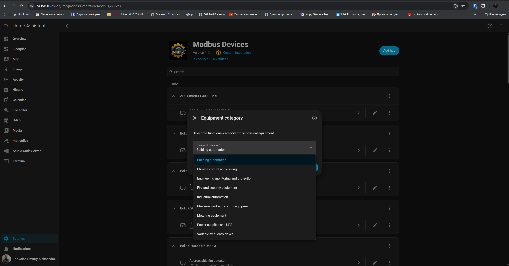

<p align="center">
  
</p>

# Modbus Devices для Home Assistant

[English](README.md) | [Русский](README_RU.md)

Modbus Devices — локальная интеграция Home Assistant для явно поддерживаемого промышленного и инженерного оборудования. Каждый физический прибор представлен отдельным устройством Home Assistant с полезными сущностями, проверкой обмена и поведением конкретной модели.

## Новое в 1.4.0 — управление насосом ERMAN и выходами ТРМ-138

В релизе добавлен реализованный по документации профиль насосного
преобразователя **ERMAN ER-G-220-05**: групповой мониторинг рабочих параметров,
состояния и ошибки, явные командные кнопки и защищённое управление Y1/Y2.
Реализация покрыта автоматическими протокольными тестами и готова к проверке
владельцем физического оборудования.

Для Owen ТРМ-138 добавлены параметры `Состояние ВУ 1…8`. Каждый выход читается
через FC01 и записывается строго проверенной командой FC05 только при отсутствии
его привязки к каналу `C.dr`. Home Assistant публикует новое состояние лишь
после точного перечитывания FC01.

Миграция существующих конфигураций не требуется. Обновите интеграцию и
перезапустите Home Assistant.

## Основные возможности

- Modbus TCP/IP, native Modbus UDP/IP, последовательный Modbus RTU, Modbus RTU over UDP и Modbus RTU over TCP.
- Явно описанные модели оборудования 4VRS, APC, Bolid, Daikin, Dyna Drive,
  ERMAN, Haier, Owen и Zuked.
- Прямые Modbus-подключения и оборудование за поддерживаемыми шлюзами.
- Топологии Bolid С2000-ПП, Orion, КДЛ, ДПЛС и С2000Р-АРР.
- Управление климатом, датчики, бинарные датчики, переключатели и кнопки в соответствии с моделью.
- Строгая проверка ответов, групповой и координированный опрос там, где он уместен.
- Безопасное явное управление только для оборудования с поддерживаемым протоколом команд.
- Настройка через интерфейс, локализация на русском/английском и генератор стандартной карточки Home Assistant.

## Поддерживаемые подключения

| Подключение | Типичное применение |
|---|---|
| Modbus TCP/IP | Оборудование и шлюзы с native Modbus TCP |
| Modbus UDP/IP | Native Modbus-сообщения поверх UDP |
| Последовательный Modbus RTU | Прямые подключения RS-485/COM |
| Modbus RTU over UDP | Полные RTU-кадры внутри UDP-датаграмм |
| Modbus RTU over TCP | Полные RTU-кадры с CRC внутри прозрачного RAW TCP-потока, без MBAP |

Native Modbus UDP и RTU-over-UDP используют разные форматы данных. Выбирайте подключение, соответствующее прибору или шлюзу.

## Поддерживаемое оборудование

Поддержка определяется конкретной моделью: наличие производителя в списке не означает совместимость со всеми его приборами и исполнениями.

### Bolid — прямое подключение и оборудование Orion

| Модель | Подключение | Основные возможности |
|---|---|---|
| M3000-BB-1020 | Прямой Modbus | Дискретные входы, релейные выходы, часы и диагностика |
| С2000-ПП | Прямой Modbus-шлюз | Режим/связь Orion, вскрытие, питание и привязка подчинённого оборудования |
| С2000-КПБ | С2000-ПП / Orion | Настроенные состояния выходов и цепей, поддерживаемое управление |
| С2000-2 | С2000-ПП / Orion | Состояния прибора, входов и доступа только для чтения |
| С2000-4 | С2000-ПП / Orion | Состояния прибора и настроенных входов только для чтения |
| Сигнал-20М | С2000-ПП / Orion | Состояния прибора и настроенных входов только для чтения |
| С2000-БКИ | С2000-ПП / Orion | Диагностическое состояние прибора только для чтения |
| МИП-24 исп.20 | С2000-ПП / Orion | Состояния питания, электрические измерения, заряд батареи и вскрытие |

Время M3000 доступно в Home Assistant только для чтения. Если часы прибора содержат недопустимое время или существенно расходятся со временем Home Assistant, интеграция может автоматически скорректировать их через проверенную команду Modbus.

### Bolid — проводное оборудование КДЛ/ДПЛС через С2000-ПП

| Модель | Подключение | Основные возможности |
|---|---|---|
| С2000-КДЛ | С2000-ПП / Orion | Состояние контроллера и топология ДПЛС |
| ДИП-34А-05 | С2000-ПП / ДПЛС | Состояние дымового извещателя |
| С2000-ИП-03 | С2000-ПП / ДПЛС | Состояние теплового извещателя и дополнительное измерение температуры |
| С2000-ДЗ | С2000-ПП / ДПЛС | Состояние протечки и обнаружение влаги |
| С2000-СТ исп.04 | С2000-ПП / ДПЛС | Разбитие стекла, тревога, вскрытие и неисправность |
| С2000-СМК исп.04 | С2000-ПП / ДПЛС | Состояние открытия и тревожная индикация |
| С2000-ВТ | С2000-ПП / ДПЛС | Температура, относительная влажность и состояния обоих каналов |
| С2000-ВТИ | С2000-ПП / ДПЛС | Температура, относительная влажность и состояния обоих каналов; исп.01 не поддерживается |
| С2000-СП4/24(220) | С2000-ПП / ДПЛС | Состояние привода и поддерживаемое управление |
| С2000-СП2 | С2000-ПП / ДПЛС | Состояние выходов/реле только для чтения |
| СВК15-3-2-Б | С2000-ПП / ДПЛС | Состояние водосчётчика и накопленный расход воды |
| СВК15-3-8-1-Б3 | С2000-ПП / ДПЛС | Состояние водосчётчика; автоматический опрос счётчика отключён по безопасности |

Поддерживаются исполнения С2000-СП4 `/24`, `/24 исп.01`, `/220` и `/220 исп.01`; `/220 исп.02` не поддерживается.

### Bolid — радиоустройства, представленные через КДЛ/ДПЛС

| Модель | Подключение | Основные возможности |
|---|---|---|
| С2000Р-АРР125 | С2000-ПП / КДЛ | Состояние радиоконтроллера |
| С2000Р-ДИП | С2000-ПП / АРР/КДЛ | Дым, вскрытие корпуса, диагностика основной и резервной батарей |
| С2000Р-ИП | С2000-ПП / АРР/КДЛ | Тепловое состояние, вскрытие, две батареи, неисправность измерительного канала |
| С2000Р-РМ | С2000-ПП / АРР/КДЛ | Два независимо управляемых реле; состояние контролируемой цепи для стандартного исполнения |
| С2000Р-Сирена | С2000-ПП / АРР/КДЛ | Независимое управление светом и звуком |
| С2000Р-СТ исп.01 | С2000-ПП / АРР/КДЛ | Разбитие стекла/тревога, вскрытие и диагностика батареи |
| С2000Р-СМК | С2000-ПП / АРР/КДЛ | Контакт/тревога, вскрытие, одна батарея и дополнительное состояние внешнего входа |
| С2000Р-ДЗ | С2000-ПП / АРР/КДЛ | Состояние протечки, обнаружение влаги и диагностика основной/резервной батарей |
| С2000Р-ВТИ | С2000-ПП / АРР/КДЛ | Температура, относительная влажность, состояния обоих каналов и основной батареи |

Некоторые документированные события Bolid требуют соответствующей настройки и ретрансляции в АРР/КДЛ/С2000М/PProg/С2000-ПП. Если сущность не меняется, сначала проверьте передачу события до С2000-ПП: само по себе это не доказывает неисправность прибора или интеграции.

### Haier

| Модель | Подключение | Основные возможности |
|---|---|---|
| [YCJ-A002](https://haier-rus.ru/product/ycj-a002-soglasovatel/) | Modbus RTU, включая RTU over TCP через RAW TCP-шлюз | Питание, режим HVAC, заданная/текущая температура, вентилятор, диагностика ошибки и блокировки |

Адаптер должен быть настроен на открытый протокол Modbus RTU
(BM1: переключатель 1 OFF, переключатель 2 ON). Документированные параметры
по умолчанию: 19200 бод, 8 бит данных, без чётности, 1 стоп-бит.
Интеграция использует адреса с нуля из
[официальной инструкции YCJ-A002](https://haier-rus.ru/wp-content/uploads/2020/11/instrukcziya_ycj-a002.pdf):

| Область данных | Адрес | Доступ | Назначение |
|---|---:|---|---|
| Coil | 0 | FC01 / FC05 | Питание |
| Holding register | 0 | FC03 / FC06 | Заданная температура, 16–30 °C |
| Holding register | 1 | FC03 / FC06 | Режим HVAC |
| Holding register | 2 | FC03 / FC06 | Режим вентилятора |
| Holding register | 3 | FC03 | Состояние блокировки контроллера |
| Input register | 0 | FC04 | Температура помещения |
| Input register | 1 | FC04 | Код ошибки |
| Input register | 2 | FC04 | Номер блока совместимости |

Специализированная карточка YCJ-A002 содержит основное управление климатом.
Ошибки, блокировка и исходные значения протокола доступны в диагностических
атрибутах сущности.

Успешная работа физического YCJ-A002 в Home Assistant подтверждена через новый
транспорт RTU over TCP: 4VRS Gateway RAW TCP `10.0.2.13:502`, slave ID `1`.
Это параметры проверенного стенда; для своего оборудования укажите собственные
адрес шлюза, порт и адрес прибора.

### Daikin

| Модель | Подключение | Основные возможности |
|---|---|---|
| [RTD-RA](https://www.daikin.eu/en_us/products/product.html/RTD-RA.html) | Прямой Modbus RTU | Питание, режим HVAC, заданная/текущая температура, пять скоростей вентилятора, движение жалюзи, ошибки и температура на входе теплообменника |

RTD-RA использует Modbus RTU через трёхпроводную RS-485. Документированные
параметры по умолчанию: 9600 бод, без чётности, 1 стоп-бит. Обозначения регистров в
[официальной инструкции RTD-RA](https://support.realtime-controls.co.uk/hc/en-us/article_attachments/360007028079)
уже являются адресами протокола с нуля: H0001 соответствует адресу 1.
Интеграция использует следующие регистры:

| Обозначение в инструкции | Адрес | Доступ | Назначение |
|---|---:|---|---|
| H0001 | 1 | FC03 / FC06 | Заданная температура |
| H0002 | 2 | FC03 / FC06 | Режим вентилятора |
| H0003 | 3 | FC03 / FC06 | Режим HVAC |
| H0004 | 4 | FC03 / FC06 | Остановка/движение жалюзи |
| H0005 | 5 | FC03 / FC06 | Питание |
| I0121 | 121 | FC04 | Наличие ошибки |
| I0122 | 122 | FC04 | Код ошибки |
| I0123 | 123 | FC04 | Температура возвратного воздуха, знаковое значение ×100 |
| I0130 | 130 | FC04 | Состояние термостата |
| I0131 | 131 | FC04 | Температура на входе теплообменника, знаковое значение ×100 |

В специализированной карточке RTD-RA управление климатом размещено первым,
а температура на входе теплообменника — в диагностическом разделе. Настройте
тайм-аут Modbus-мастера RTD-RA с учётом установки: интеграция не отправляет
искусственные записи для поддержания связи. Указания по установке и режимам
работы приведены также на
[официальной странице поддержки RTD-RA](https://support.realtime-controls.co.uk/hc/en-us/articles/360010965160-How-to-install-the-RTD-RA).

Обе модели покрыты автоматическими тестами протокола, сущностей, карточек и
полным регрессионным набором. YCJ-A002 аппаратно проверен через указанный выше
4VRS RAW TCP; аппаратная проверка RTD-RA пока не выполнена.

### 4VRS

| Модель | Подключение | Основные возможности |
|---|---|---|
| [Haier-ESP32](https://github.com/dk-1983/Haier-ESP32-Modbus) | Modbus RTU или Modbus TCP | Питание, режим HVAC, заданная/текущая температура, вентилятор, качание и фиксированные положения жалюзи, preset, тихий режим, дисплей и диагностика связи/команд |

Haier-ESP32 реализован как отдельный профиль фирменных разработок 4VRS;
существующий профиль Haier YCJ-A002 не изменён. При разработке за совместимую
основу был взят набор регистров заводского YCJ-A002. Haier-ESP32-Modbus
расширяет эту основу дополнительными регистрами, необходимыми для новой
функциональности и описанными в
[карте Haier-ESP32](https://github.com/dk-1983/Haier-ESP32-Modbus/blob/main/docs/REGISTERS.md).
Это отдельное устройство 4VRS, а не прошивка или расширение физического
контроллера YCJ-A002.
После принятия записи интеграция сериализованно ожидает подтверждение в Input 7
и перечитывает фактический coil или holding-регистр. Оптимистическое состояние
Home Assistant не применяется. AUTO-состояния жалюзи отображаются, но не
предлагаются среди доступных команд.

Диагностические Input-регистры 4…8 читаются отдельно. Поэтому возраст status,
32-битный счётчик пакетов с младшим словом первым, состояние команды и флаги
RTU/TCP остаются доступны, даже когда устаревшая основная телеметрия возвращает
исключение 0x0B.

### APC

| Модель | Подключение | Основные возможности |
|---|---|---|
| [Smart-UPS 3000 RM XL](https://www.se.com/us/en/download/document/SPD_ASTE-6YWRZN_EN/) | Modbus TCP через AP9630/NMC2 | Только чтение: входное/выходное напряжение, частота, нагрузка, заряд/напряжение/время батареи, внутренняя температура, питание от сети/батареи, разряд, замена батареи, перегрузка, AVR и калибровка |

Реализация соответствует официальной карте регистров Schneider Electric
[990-5702A-EN](https://www.se.com/ae/en/download/document/Modbus_MGE_Galax_Smart_UPS/)
и выполняет только групповые чтения FC03. Команды и изменение конфигурации UPS
не предоставляются. Профиль аппаратно проверен на физическом Smart-UPS 3000 RM XL.

При проверке использовалась [сетевая карта AP9630 Network Management Card 2](https://www.se.com/uk/en/faqs/FA237786/),
аппаратная ревизия 05. Исходное ПО AOS 5.1.7 / SUMX 5.1.7 / Boot Monitor 1.0.2
не предоставляло необходимый сервис Modbus TCP. Перед аппаратной проверкой карта
была обновлена официальным пакетом Schneider Electric
`apc_hw05_aos722_sumx722_bootmon109.exe` до
[AOS 7.2.2 / SUMX 7.2.2](https://www.se.com/us/en/download/document/APC_SUMX_EN/)
и Boot Monitor 1.0.9.

### Owen

| Модель | Подключение | Основные возможности |
|---|---|---|
| ПЛК110-24.60.К-М | Прямой Modbus | 36 настраиваемых дискретных входов и 24 управляемых выхода |
| TRM-138 | Прямой Modbus | Восемь температурных каналов IEEE-754, привязки `C.dr 1…8` и управление состояниями `Состояние ВУ 1…8` |

Измерения ТРМ-138 читаются одним групповым снимком FC04. Параметры `C.dr`
расположены в документированных holding-регистрах 65…72, совместно читаются
через FC03 и поканально записываются через FC06 со строгой проверкой функции,
адреса прибора, регистра и зеркального значения. Допустимы только целые 0…8.

Переключатели с документированными названиями `Состояние ВУ 1…8` совместно
читают coils 0…7 через FC01. Ручная команда FC05 разрешается только для ВУ,
которое не назначено ни одному `C.dr`. Перед публикацией нового состояния
строго проверяются зеркальный ответ FC05 и точное перечитывание FC01.
Интеграция никогда не обнуляет привязку `C.dr` автоматически.

### Zuked

| Модель | Подключение | Основные возможности |
|---|---|---|
| 310-4.0S1 | Прямой Modbus | Чтение рабочих параметров преобразователя и диагностика ошибок без управления |

### Dyna Drive

| Модель | Подключение | Основные возможности |
|---|---|---|
| DN310 | Прямой Modbus | Экспериментальный мониторинг, диагностика и явные командные кнопки |

### ERMAN

| Модель | Подключение | Основные возможности |
|---|---|---|
| ER-G-220-05 | Прямой Modbus | Частота, ток, напряжение, температура, давление и аналоговые входы насосного преобразователя; рабочее состояние и ошибки; пуск, останов, аварийный останов, сброс аварии, сохранение/загрузка параметров и управление Y1/Y2 |

Первоначальный профиль ER-G-220-05 соответствует
[документу протокола MODBUS версии 1.2](https://github.com/user-attachments/files/32493266/protocol_modbus_erg-220-05.pdf)
для ПО 01.25. Input-регистры 2000…2009 читаются одним блоком FC04.
Давление публикуется в `atm`, как указано в документе; это намеренно отличается
от пользовательских конфигураций, где то же исходное значение могло быть
подписано как `bar`.

Предоставлены только документированные незарезервированные coils команд.
Ответы FC05 строго проверяются. Для записи Y1/Y2 дополнительно требуется
значение `4` соответственно в P118/P120; проверка параметра, запись и точное
перечитывание FC01 выполняются как одна физически сериализованная операция.
Состояние Home Assistant обновляется только после совпавшего readback. Профиль
покрыт автоматическими тестами и ожидает проверки владельцем физического
прибора.

## Установка

### HACS (рекомендуется)

Modbus Devices доступна в стандартном каталоге интеграций HACS:

1. Откройте **HACS → Интеграции**.
2. Найдите **Modbus Devices**.
3. Установите интеграцию и перезапустите Home Assistant.
4. Откройте **Настройки → Устройства и службы → Добавить интеграцию → Modbus Devices**.

### Ручная установка

Скопируйте `custom_components/modbus_devices` в каталог `custom_components` конфигурации Home Assistant, перезапустите Home Assistant и добавьте **Modbus Devices** в разделе **Устройства и службы**.

## Добавление оборудования

Вся настройка выполняется через интерфейс Home Assistant.

### Вариант 1 — прямое Modbus-устройство

1. Добавьте **Modbus Devices** и выберите **Добавить новый хаб**.
2. Выберите TCP, UDP, последовательный RTU, RTU over UDP или RTU over TCP.
3. Выберите функциональный раздел оборудования.
4. Выберите производителя и точную модель.
5. Укажите адрес/порт либо параметры последовательного соединения и Modbus Unit ID.
6. Завершите настройку; для физического прибора будет создано одно устройство Home Assistant.

Разделы сохраняют удобную навигацию по растущему каталогу. Раздел относится к
физической модели, а не к производителю, поэтому один производитель может быть
представлен в нескольких разделах. Технические названия моделей и параметров
протокола сохраняются в точном соответствии с документацией производителя.

<p align="center"></p>

<p align="center"></p>

<p align="center"></p>

<p align="center"></p>

<p align="center"></p>

<p align="center"></p>

### Вариант 2 — оборудование через существующий С2000-ПП

Сначала добавьте и проверьте шлюз С2000-ПП. Затем снова добавьте **Modbus Devices** и выберите **Через существующий С2000-ПП**.

1. Выберите функциональный раздел оборудования.
2. Выберите нужный шлюз С2000-ПП.
3. Выберите физическую модель подчинённого прибора.
4. Укажите адрес КДЛ в Orion и базовый адрес ДПЛС прибора.
5. Используйте привязку по конфигурации, если она доступна, либо выберите строку ПП вручную.
6. Повторите процедуру для каждого дополнительного физического устройства.

Привязка по конфигурации читает таблицу выбранного С2000-ПП и предлагает совместимые незанятые строки. Физическая модель при этом не определяется автоматически — всегда сначала выбирайте фактический прибор. Если единственная совместимая строка не найдена, ручная привязка позволяет указать известную строку таблицы зон/реле и необходимые возможности; интеграция всё равно проверяет их для выбранной модели.

<p align="center"></p>

<p align="center"></p>

<p align="center"></p>

<p align="center"></p>

<p align="center"></p>

Адреса Orion и ДПЛС идентифицируют физический прибор, а строка ПП является его текущим представлением в шлюзе. Один физический прибор представлен одним устройством Home Assistant, даже если у него несколько сущностей.

<p align="center"></p>

## Необязательный генератор карточки устройства

1. Перейдите в режим редактирования панели и выберите **Добавить карточку**.
2. Выберите **Modbus Device**.
3. Выберите физическое устройство.
4. Проверьте созданный список сущностей и сохраните карточку.

<p align="center"></p>

<p align="center"></p>

<p align="center"></p>

<p align="center"></p>

После сохранения результат является обычной стандартной карточкой Home Assistant `type: entities`. Постоянной обёртки Modbus Devices нет, карточку можно редактировать как обычно.

## Архитектура

```text
Производитель → Модель оборудования → Подключение или шлюз → Координатор
                                                           → Устройство и сущности HA
```

```text
Home Assistant ← Modbus ← С2000-ПП ← Orion ← С2000-КДЛ ← устройство ДПЛС
                                                   ↖ радиооборудование С2000Р-АРР
```

## Modbus RTU over TCP (4VRS RAW TCP)

Для прозрачного RAW TCP транспорта 4VRS Gateway, в том числе с Haier YCJ-A002,
выберите **Modbus RTU через TCP**. Укажите хост шлюза, настроенный RAW TCP-порт,
адрес прибора (1–247) и тайм-аут. Порт 502 в форме — только значение по умолчанию;
используйте фактический порт шлюза. Параметры RS-485 настраиваются на шлюзе.
Config flow проверяет TCP-подключение, а опрос прибора проверяет ответы RTU.

Поддерживаются FC01/02/03/04/05/06/16. Транспорт собирает ответ из частей TCP-потока,
проверяет длину, CRC, адрес прибора, функцию, число байтов и эхо записи.
Сериализация запросов остаётся в `SerializedModbusClient`.

При тайм-ауте, отмене, ошибочном ответе или обрыве неполного кадра соединение
закрывается. Следующий самостоятельный запрос подключается заново; неуспешная
команда автоматически не повторяется. Лишние кадры и накопленные данные без
запроса отклоняются. У RTU нет идентификатора транзакции: шлюз не должен переносить
старые последовательные ответы в новое TCP-соединение. Произвольно запоздавший
идентичный ответ невозможно отличить от нового. На шине должен быть один мастер.

Опрос и управление YCJ-A002 покрыты тестами с TCP-эмулятором. Работа физического
YCJ-A002 в Home Assistant также подтверждена через 4VRS RAW TCP
(`10.0.2.13:502`, slave ID `1`); подробности — в [отчёте RTU over TCP](docs/rtu_over_tcp.md).
Отображение ключа перевода `rtu_over_tcp` при проверке было вызвано frontend-кэшем
и исправилось после обновления страницы. Конфигурация production не изменялась.

## Modbus RTU over UDP

RTU-over-UDP передаёт полные кадры Modbus RTU, включая адрес и CRC, внутри UDP-датаграмм. Это не native Modbus UDP. Укажите адрес шлюза, UDP-порт, Unit ID и тайм-аут ответа; шлюзу с фиксированным peer также может требоваться ожидаемая конечная точка отправителя.

## Устранение неполадок

- Сверьте адрес, порт, Unit ID и параметры последовательного соединения с настройками оборудования.
- Убедитесь, что выбран правильный транспорт; native UDP и RTU-over-UDP не взаимозаменяемы.
- Для оборудования за С2000-ПП проверьте модель, адреса Orion/ДПЛС, строку ПП и ретрансляцию событий Bolid.
- При тайм-ауте, Modbus-исключении или некорректном ответе сущности становятся недоступными, а не показывают ложную норму.
- Убедитесь, что последовательный порт не занят другим приложением.

## Ограничения и границы поддержки

- Поддержка и набор сущностей определены для точных моделей; похожие исполнения не считаются совместимыми автоматически.
- Физическая функция отображается только при наличии достоверного пути через поддерживаемую Modbus-топологию.
- Версия прошивки, прочитанная из прибора, серийный номер, радиоадрес, RSSI и похожие метаданные показываются только тогда, когда их действительно можно получить.
- Управление доступно только для явно поддерживаемых команд; часть оборудования намеренно работает только на чтение.
- Zuked 310-4.0S1 предоставляет только мониторинг, без управления двигателем и записи конфигурации.
- Dyna Drive DN310 остаётся экспериментальной моделью; сверяйте профиль с целевым оборудованием.

## Разработка и подробная документация

Реализации создаются отдельно для каждого производителя и модели. Проверка включает целевые и регрессионные тесты pytest, Ruff, Hassfest, компиляцию и контроль пробельных ошибок. Подробные разборы протоколов, аппаратные свидетельства и аудиты семейств находятся в [`docs/`](docs/).

## Ссылки проекта

- [Репозиторий GitHub](https://github.com/dk-1983/Modbus_Devices)
- [Сообщить о проблеме](https://github.com/dk-1983/Modbus_Devices/issues)
- [Релизы](https://github.com/dk-1983/Modbus_Devices/releases)
- [Лицензия](LICENSE.md)
- [Bolid](https://bolid.ru/)
- [Daikin RTD-RA](https://www.daikin.eu/en_us/products/product.html/RTD-RA.html)
- [Dyna Drive](https://www.dninno.com/)
- [ERMAN](https://www.erman.ru/)
- [Haier YCJ-A002](https://haier-rus.ru/product/ycj-a002-soglasovatel/)
- [Owen](https://owen.ru/)

## Автор

[Дмитрий Криволап](https://4vrs.online)
