# Modbus Devices для Home Assistant

**[English](README.md) | [Русский](README_RU.md)**

Modbus Devices — пользовательская интеграция Home Assistant для явно поддерживаемых приборов промышленной автоматизации и инженерных систем. Каждая модель оборудования определяет собственные доступные через Modbus возможности, сущности, правила проверки и, при необходимости, привязку к шлюзу.

Интеграция работает как локально опрашиваемый хаб для Modbus-совместимого оборудования нескольких производителей с прямым подключением либо поддержанной gateway/topology mapping. Канонический реестр сейчас содержит оборудование Bolid, Dyna Drive и Owen.

## Основные возможности

- Подключения Modbus TCP/IP, native Modbus UDP/IP, последовательный Modbus и Modbus RTU over UDP.
- Создание sensor, binary sensor, switch, datetime и button entities на основе модели оборудования.
- Типизированные исполнения приборов и возможности, зависящие от выбранной топологии.
- Поддержка шлюза С2000-ПП, Orion, С2000-КДЛ и подчинённого оборудования ДПЛС.
- Ручной и configuration-assisted mapping.
- Авторитетные мультисостояния Orion с основным, расширенными и исходными кодами состояний.
- Документированные числовые измерения, включая температуру и влажность там, где их поддерживает путь через С2000-ПП.
- Управление реле/выходами с проверкой ответа записи, оптимистической синхронизацией и защитой от устаревшего результата опроса.
- Явная обработка ошибок связи и некорректных ответов: ошибка не отображается как нормальное или выключенное состояние.
- Централизованный coordinator polling, grouped reads где возможно, сериализация запросов каждого клиента и общая строгая проверка ответов.
- Совместимая загрузка старых записей конфигурации при отображении канонических производителей и моделей.

Поддержка определяется конкретной моделью. Наличие производителя в списке не означает поддержку всех его приборов или всех физических функций конкретного прибора.

## Архитектура

```text
Manufacturer
  → Equipment model
    → Transport или gateway
      → Resolved mapping
        → Coordinator snapshot
          → Home Assistant Device и entities
```

Приборы с прямым подключением опрашиваются через выбранное Modbus-соединение. Для оборудования Bolid за шлюзом используется дополнительный слой привязки, который отделяет идентичность физического устройства от строк таблиц С2000-ПП, применяемых для чтения или управления.

### Путь Bolid Orion и ДПЛС

```text
Home Assistant
  ← Modbus
    ← С2000-ПП
      ← Orion
        ← С2000-КДЛ
          ← устройство ДПЛС
```

Радиоустройства остаются самостоятельными объектами ДПЛС, видимыми КДЛ:

```text
радиоустройство ↔ С2000Р-АРР125
                → KDL-visible DPLS object
                → С2000-КДЛ
                → С2000-ПП
                → Home Assistant
```

Радиорасширитель не добавляется в стабильный идентификатор радиоустройства. В пределах одного шлюза идентичность подчинённого прибора определяется Orion-адресом КДЛ и DPLS-адресом прибора.

## Поддерживаемые способы подключения

| Способ подключения | Настройка |
|---|---|
| Modbus TCP/IP | Host, port и Modbus unit ID |
| Modbus UDP/IP | Host, port и Modbus unit ID |
| Последовательный Modbus RTU | Последовательный порт, baud rate, byte size, parity, stop bits и unit ID |
| Modbus RTU over UDP | Remote host/port, фиксированный local UDP port, timeout, опциональный local bind address и downstream device ID |

Native Modbus UDP/IP и Modbus RTU over UDP — разные протоколы на проводе. Native UDP передаёт Modbus application framing через UDP. RTU over UDP помещает в UDP raw Modbus RTU ADU вместе с CRC и не использует MBAP header.

Возможность использования соединения также зависит от физического интерфейса выбранного прибора.

## Поддерживаемое оборудование

Канонический registry текущего исходного кода содержит **30 моделей: Bolid 27, Dyna Drive 1 и Owen 2**. Названия ниже — пользовательские названия производителя, а не имена Python-классов.

### Bolid — прямой Modbus и шлюз С2000-ПП

| Производитель | Модель | Подключение / шлюз | Сущности / возможности Home Assistant | Примечания |
|---|---|---|---|---|
| Bolid | [M3000-BB-1020](https://bolid.ru/production/disp/inout-modules/m3000_vv_1020.html) | Прямой Modbus | 12 дискретных входов, 6 релейных переключателей, часы прибора | Служебные данные экземпляра читаются из прибора |
| Bolid | [С2000-ПП](https://bolid.ru/production/s2000-pp.html) | Прямой Modbus | Диагностические бинарные датчики шлюза | Режим/связь Orion master, вскрытие корпуса и неисправность питания; служебные данные при наличии в протоколе |
| Bolid | С2000-КПБ | С2000-ПП → Orion | Настроенные переключатели выходов и датчики мультисостояний | До 6 выходов/состояний цепей, 2 технологических входа и состояние прибора; сущности соответствуют настроенному набору |
| Bolid | С2000-2 | С2000-ПП → Orion | Только чтение состояния прибора и настроенных входов/точек доступа | Direct Orion; команды управления доступом не публикуются |
| Bolid | С2000-4 | С2000-ПП → Orion | Только чтение состояния прибора и до четырёх настроенных входов | Управление реле намеренно не публикуется |
| Bolid | Сигнал-20М | С2000-ПП → Orion | Только чтение состояния прибора и до 20 настроенных входов | Class не распространяется на Сигнал-20П, Сигнал-20П исп.01 и Сигнал-20 сер.04 |
| Bolid | С2000-БКИ | С2000-ПП → Orion | Только собственное диагностическое состояние блока | Внешние разделы/индикаторы не дублируются; С2000-БКИ 2RS485 этой class не поддерживается |
| Bolid | [МИП-24 исп.20](https://bolid.ru/production/mip-24_20.html) | С2000-ПП / Orion RS-485 | Мультисостояния прибора, выходного питания, нагрузки, батареи, зарядного устройства и сети | Полное обозначение МИП-24-2/П5-Р-RS; состояние прибора обязательно, остальные пять сущностей соответствуют настроенному subset mapping; физические числовые измерения не публикуются, поскольку их текущий Modbus-путь через С2000-ПП не подтверждён |

### Bolid — С2000-КДЛ и проводные устройства ДПЛС

| Производитель | Модель | Подключение / шлюз | Сущности / возможности Home Assistant | Примечания |
|---|---|---|---|---|
| Bolid | [С2000-КДЛ](https://bolid.ru/production/s2000-kdl.html) | С2000-ПП → Orion | Диагностический датчик мультисостояния | Только собственное состояние контроллера type-3/local-0; строки подчинённых приборов остаются отдельными устройствами |
| Bolid | ДИП-34А-05 | С2000-ПП → С2000-КДЛ → ДПЛС | Рабочее мультисостояние извещателя | Один DPLS-адрес; вычисляемые датчики дыма/запылённости не создаются |
| Bolid | С2000-ИП-03 | С2000-ПП → С2000-КДЛ → ДПЛС | Мультисостояние извещателя; опциональный датчик температуры | Type-1 только с состоянием либо type-6 с состоянием и температурой; оба режима используют одну DPLS identity |
| Bolid | [С2000-ДЗ](https://bolid.ru/production/s_2000_dz.html) | С2000-ПП → С2000-КДЛ → ДПЛС | Мультисостояние затопления | Статические варианты 1.06, 1.10 и 1.13; производный бинарный датчик влаги не создаётся |
| Bolid | [С2000-СТ исп.04](https://bolid.ru/production/s2_st_04.html) | С2000-ПП → С2000-КДЛ → ДПЛС | Рабочее мультисостояние разбития стекла | Проводной одноадресный извещатель ДПЛС; служебное напряжение ДПЛС не публикуется как числовая сущность через текущий путь С2000-ПП |
| Bolid | [С2000-СМК](https://bolid.ru/production/amrs/addr-amrs-detection-hdw/) | С2000-ПП → С2000-КДЛ → ДПЛС | Мультисостояние открытия | Проводная одноадресная модель; снята производителем с производства, но документирована и поддерживается интеграцией |
| Bolid | С2000-ВТ / С2000-ВТ исп.01 | С2000-ПП → С2000-КДЛ → ДПЛС | Датчики температуры и относительной влажности | Числовые значения используют документированный цикл запросов С2000-ПП |
| Bolid | С2000-ВТИ / С2000-ВТИ исп.01 | С2000-ПП → С2000-КДЛ → ДПЛС | Через этот путь сущности сейчас недоступны | Модели зарегистрированы, но передача числовых значений через текущий путь С2000-ПП не подтверждена, поэтому настройка блокируется |
| Bolid | [С2000-СП4/24(220)](https://bolid.ru/production/s2000-sp4.html) | С2000-ПП → С2000-КДЛ → ДПЛС | Настроенный переключатель привода и датчики мультисостояний положения/цепей | Поддержанные исполнения перечислены ниже; сущности соответствуют настроенному набору mapping |
| Bolid | С2000-СП2 | С2000-ПП → С2000-КДЛ → ДПЛС | Read-only представление состояния реле | Топология с одним или двумя выходами, без controls. Class не заявляет исп.02 или исп.03 |
| Bolid | СВК15-3-2-Б | С2000-ПП → С2000-КДЛ → ДПЛС | Состояние/показания счётчика воды из реализованного mapping | Только точная зарегистрированная модель |
| Bolid | СВК15-3-8-1-Б3 | С2000-ПП → С2000-КДЛ → ДПЛС | Состояние/показания счётчика воды из реализованного mapping | Только точная зарегистрированная модель |

Поддержанные исполнения С2000-СП4:

- С2000-СП4/24
- С2000-СП4/24 исп.01
- С2000-СП4/220
- С2000-СП4/220 исп.01

**С2000-СП4/220 исп.02 не поддерживается.**

### Bolid — радиоустройства, представленные как объекты ДПЛС

| Производитель | Модель | Подключение / шлюз | Сущности / возможности Home Assistant | Примечания |
|---|---|---|---|---|
| Bolid | [С2000Р-АРР125](https://bolid.ru/production/s2r_arr125.html) | С2000-ПП → С2000-КДЛ → ДПЛС | Агрегированное мультисостояние расширителя | Аппаратные варианты 1.0 и 14.0; зарегистрированные радиоустройства не принадлежат модели расширителя |
| Bolid | С2000Р-ДИП | С2000-ПП → С2000-КДЛ → ДПЛС | Рабочее мультисостояние извещателя и радиосвязи | Состояния батарей, вскрытия и связи остаются частями мультисостояния; RSSI entity не создаётся |
| Bolid | С2000Р-ИП | С2000-ПП → С2000-КДЛ → ДПЛС | Рабочее мультисостояние извещателя и радиосвязи | Физическое измерение температуры существует, но числовая температура через текущий путь PP не подтверждена |
| Bolid | С2000Р-РМ / С2000Р-РМ исп.01 | С2000-ПП → С2000-КДЛ → ДПЛС | Два независимых релейных переключателя; опциональное состояние контролируемой цепи | Standard поддерживает топологию с двумя выходами либо двумя выходами и входом; исп.01 — только выходы |
| Bolid | С2000Р-Сирена | С2000-ПП → С2000-КДЛ → ДПЛС | Независимые переключатели Light и Sound | Общий переключатель, выбор паттерна/длительности и радиосервисные controls не создаются |
| Bolid | [С2000Р-СТ исп.01](https://bolid.ru/production/s2000r-st_01.html) | С2000-ПП → С2000-КДЛ → ДПЛС через С2000Р-АРР125 | Рабочее мультисостояние разбития стекла | Батарея, вскрытие и радиосвязь остаются семантикой мультисостояний Orion; RSSI entity не создаётся |
| Bolid | [С2000Р-СМК](https://bolid.ru/production/s2000r_smk.html) | С2000-ПП → С2000-КДЛ → ДПЛС через С2000Р-АРР125 | Мультисостояние открытия; опциональное мультисостояние внешнего входа | Занимает один или два DPLS-адреса в зависимости от настроенной topology; производный бинарный датчик открытия не создаётся |

### Owen — оборудование с прямым Modbus

| Производитель | Модель | Подключение / шлюз | Сущности / возможности Home Assistant | Примечания |
|---|---|---|---|---|
| Owen | [TRM-138](https://owen.ru/product/trm138) | Прямой Modbus | 8 датчиков температуры | Текущая реализация читает восемь настроенных измерительных каналов |
| Owen | [ПЛК110-24.60.К-М](https://files.owen.ru/catalog/product.php?cat=plc&prod=plk110_m02&sub=programmiruemie_logicheskie_kontrolleri) | Прямой Modbus | 36 дискретных входов и 24 переключателя выходов | Пользовательская битовая карта CODESYS Modbus: настраиваются область DI, начальный адрес/шаг DI и начальный адрес/шаг DO |

### Dyna Drive — оборудование с прямым Modbus

| Производитель | Модель | Подключение / шлюз | Сущности / возможности Home Assistant | Примечания |
|---|---|---|---|---|
| Dyna Drive | DN310 | Прямой Modbus | Read-only runtime diagnostics, авторитетное состояние работы, декодирование аварий и command buttons | Команды: Forward run, Reverse run, Coast stop, Decelerate stop и Fault reset. Writable frequency setpoint и jog не реализованы; интеграция автоматически не изменяет постоянные параметры привода |

## Примеры оборудования

Ниже используются локальные оптимизированные копии изображений с официальных страниц производителя. Это примеры архитектурных и DPLS-приборов, а не каталог всех поддержанных исполнений.

<p align="center">
  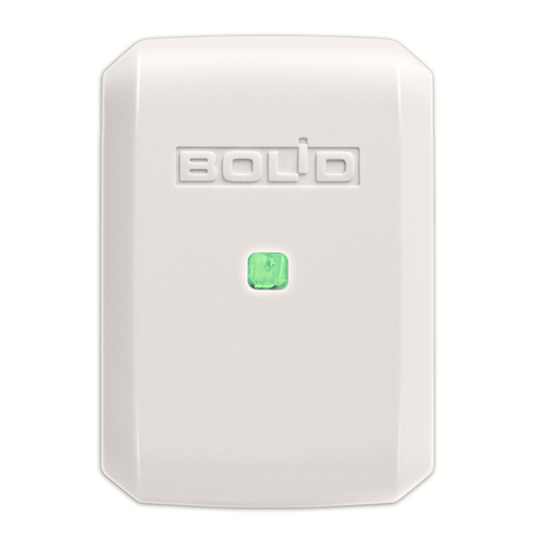
  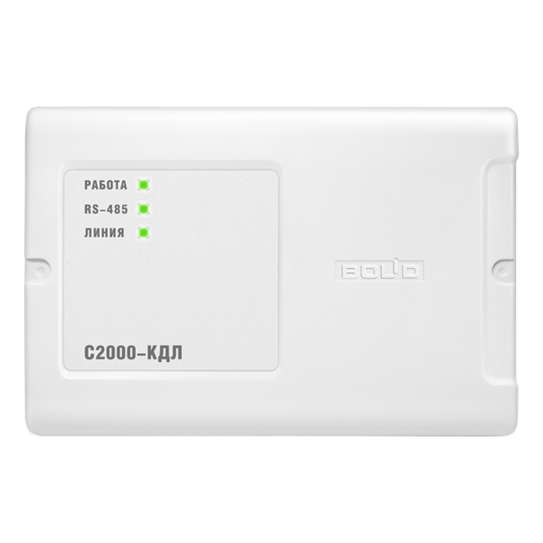
  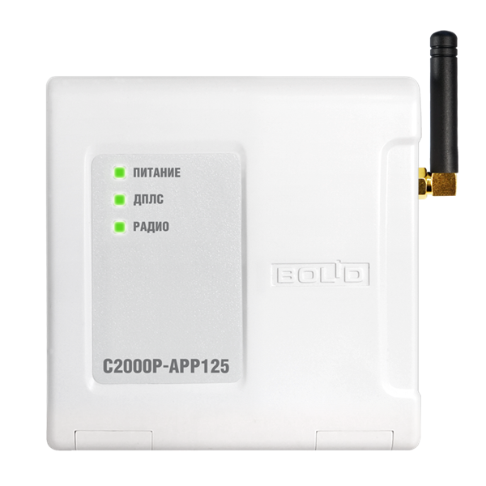
</p>
<p align="center">
  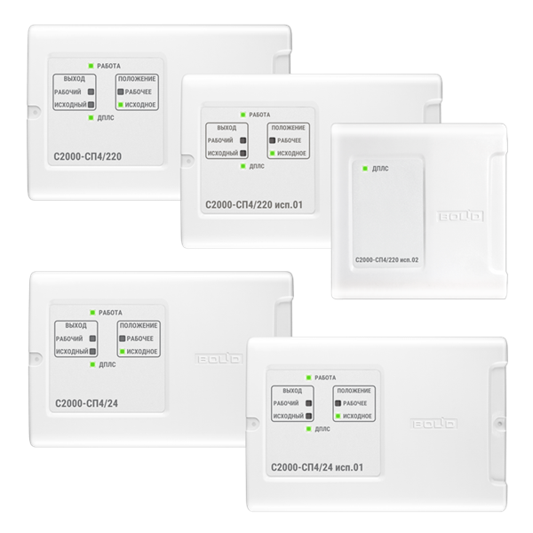
  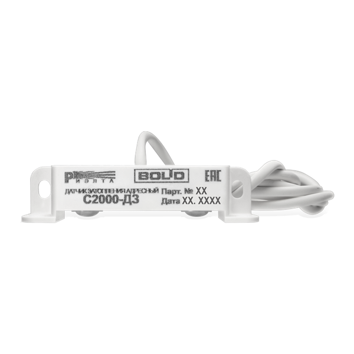
</p>

## Добавление оборудования

Настройка выполняется только через UI. Откройте **Настройки → Устройства и службы → Modbus Devices** и нажмите **Add hub**. Есть два разных сценария:

- выбор Modbus-транспорта для прибора с собственным прямым подключением;
- **Via existing S2000-PP** для оборудования Bolid, доступного через уже добавленный и загруженный С2000-ПП.

### Обычное direct Modbus-устройство

1. Выберите **ModBus TCP/IP**, **ModBus UDP/IP**, **Modbus RTU over UDP** или **SerialPort**.
2. Выберите производителя и физическую модель прибора.
3. Укажите сетевые либо последовательные параметры, Modbus unit/device ID и имя.
4. Заполните дополнительные поля модели и завершите flow.

<p align="center">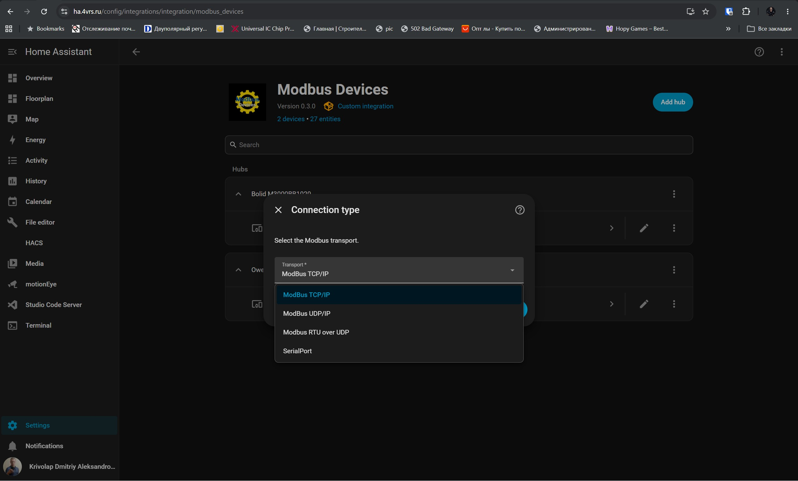</p>

<p align="center">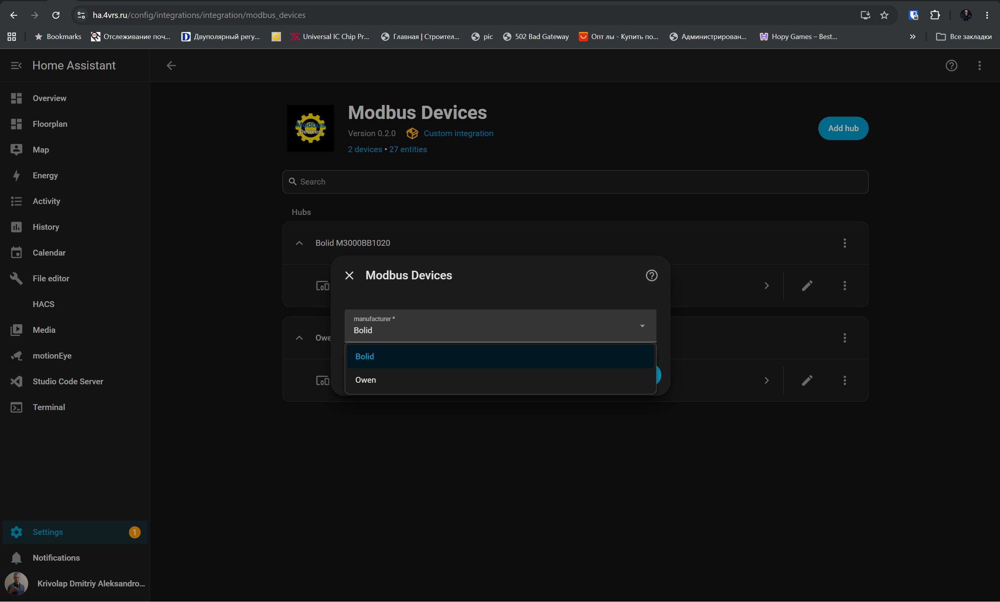</p>

<p align="center">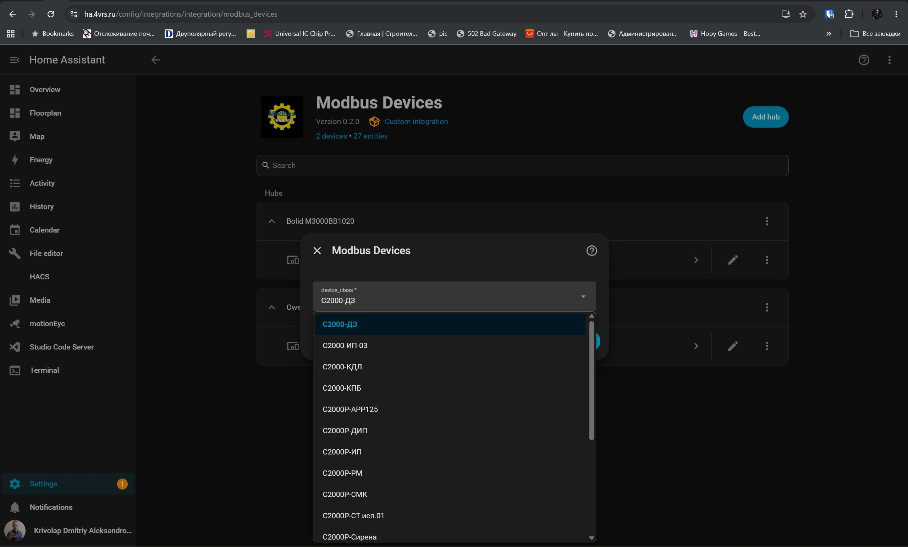</p>

<p align="center">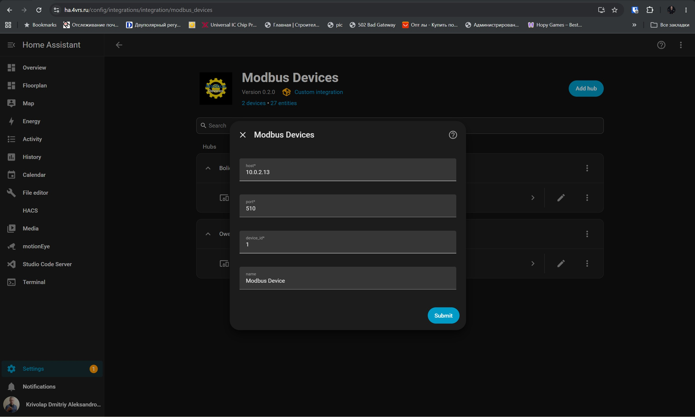</p>

После этого Home Assistant создаёт Device и набор сущностей, реализованный для выбранной модели.

<p align="center">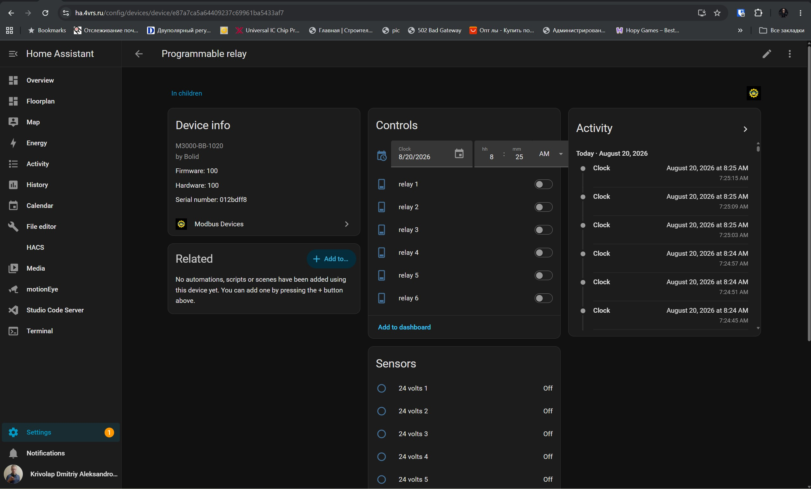</p>

### Сначала добавьте шлюз С2000-ПП

**Via existing S2000-PP доступен только при наличии хотя бы одной загруженной direct Config Entry С2000-ПП.** Добавьте шлюз как обычное прямое устройство:

1. Нажмите **Add hub** и выберите транспорт, физически подключённый к С2000-ПП.
2. Выберите **Bolid → С2000-ПП**.
3. Укажите Serial/TCP/UDP-параметры этого шлюза и его Modbus unit ID.
4. Завершите flow и убедитесь, что запись С2000-ПП загружена и не находится в состоянии unavailable.

Эта запись владеет физическим Modbus-клиентом и представляет сам шлюз, включая его диагностические сущности.

### Добавьте устройство через существующий С2000-ПП

1. Снова нажмите **Add hub** и выберите **Via existing S2000-PP**.

<p align="center">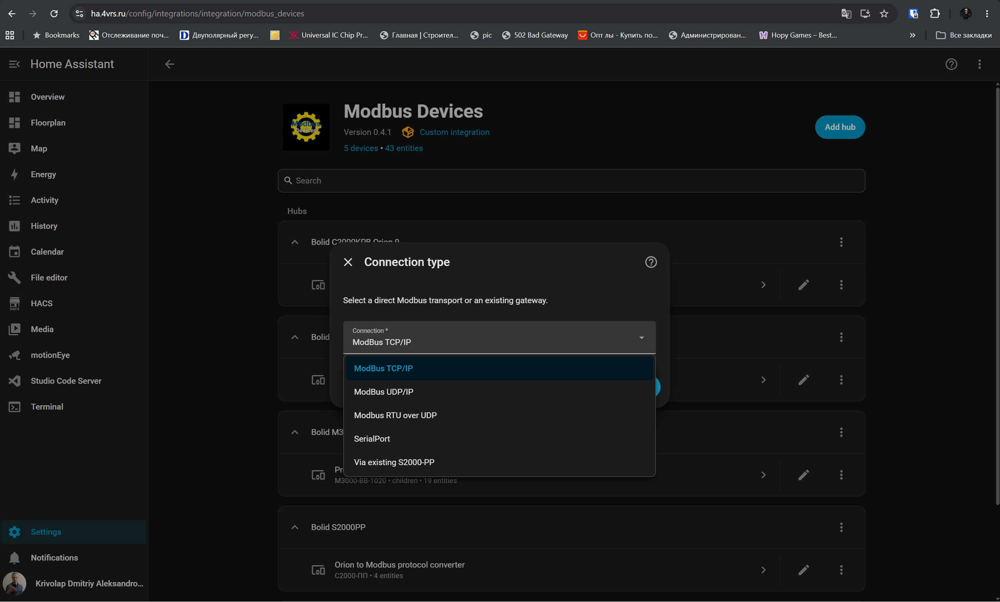</p>

Подтвердите выбранный тип подключения, чтобы открыть выбор gateway.

<p align="center">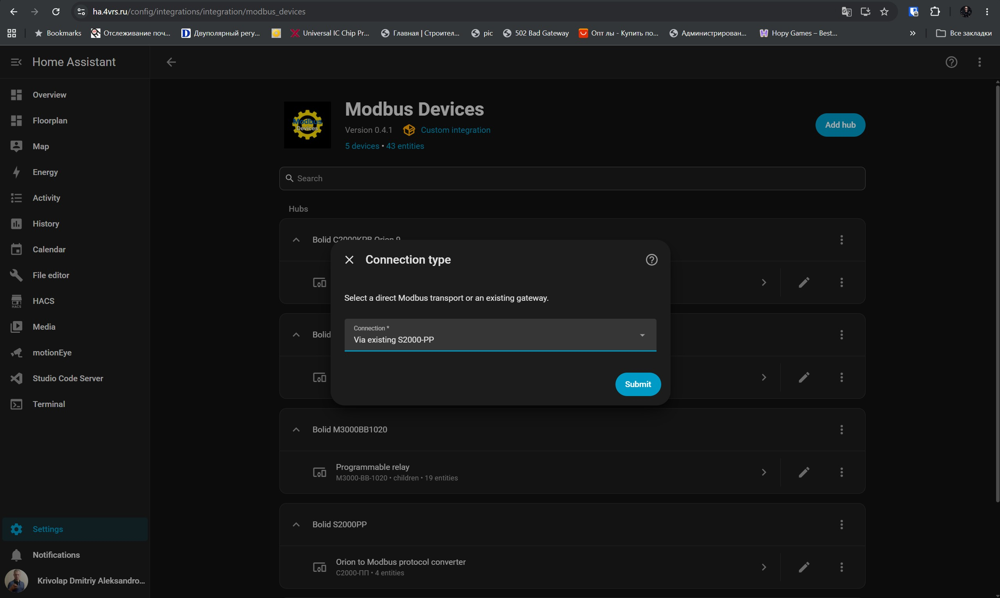</p>

2. Выберите нужный gateway. В списке находятся загруженные direct-записи С2000-ПП, поэтому при наличии нескольких шлюзов каждое дочернее устройство можно привязать к конкретному физическому С2000-ПП.

<p align="center">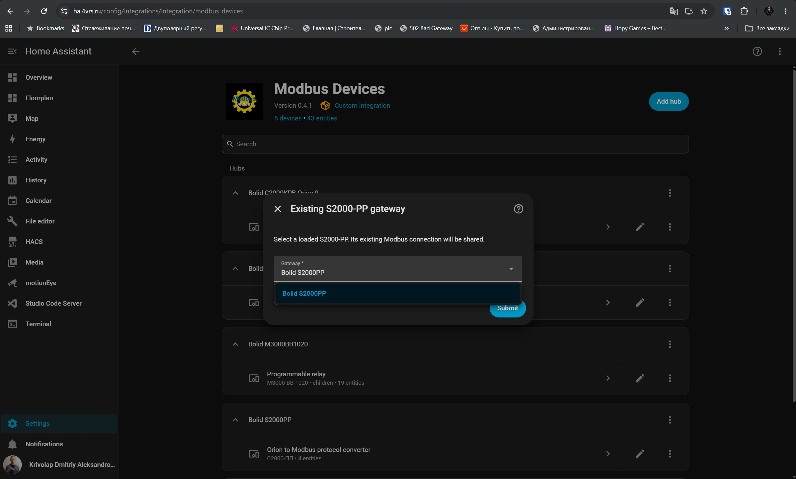</p>

3. Выберите физическую downstream-модель Bolid. Показываются только модели, поддерживающие работу через С2000-ПП.

<p align="center">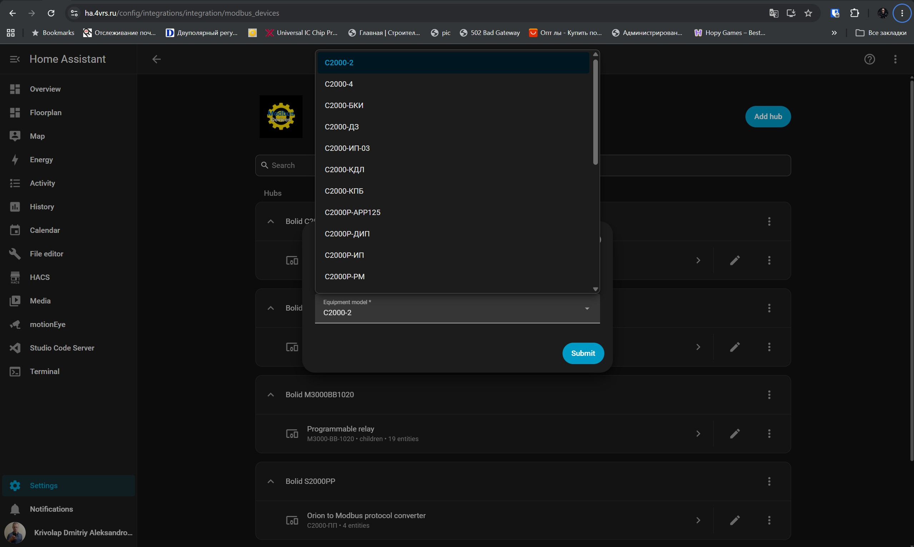</p>

4. Для ДПЛС-оборудования выберите исполнение/topology, если поле присутствует, и задайте идентификатор:

   - **KDL Orion address** — адрес контроллера С2000-КДЛ в сети «Орион» (1–127), к которому относится прибор. Это не Modbus unit ID шлюза С2000-ПП.
   - **DPLS base address** — первый адрес ДПЛС (1–127), занимаемый прибором на линии этого КДЛ. Одноадресный прибор использует только его; многоадресная topology занимает необходимое число последовательных адресов, начиная с базового.

Например, для датчика с адресом ДПЛС 5 на С2000-КДЛ с адресом «Орион» 12 укажите **KDL Orion address = 12** и **DPLS base address = 5**.

<p align="center">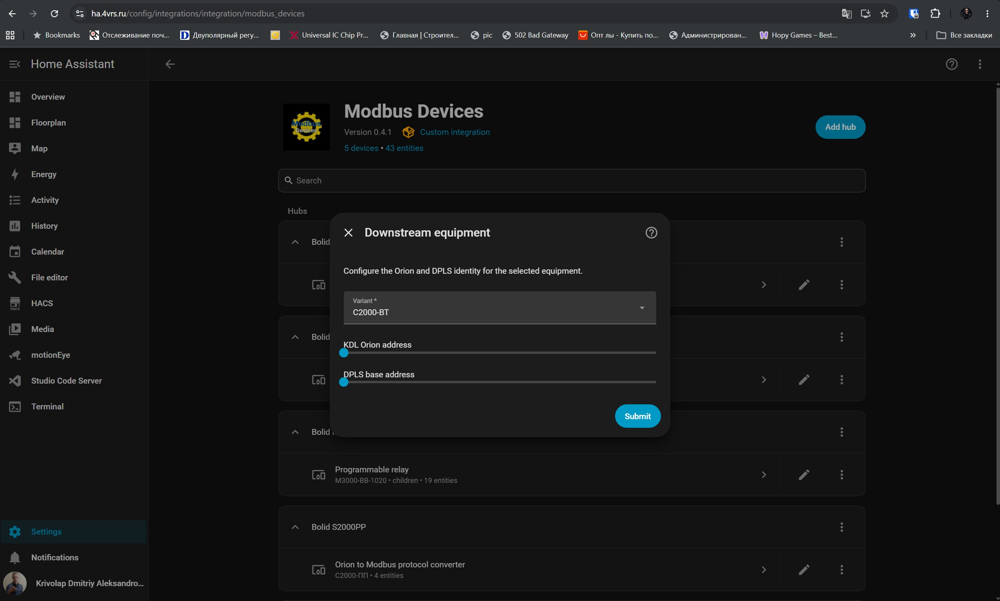</p>

Для прибора «Орион», который не находится за линией КДЛ/ДПЛС, поле **Orion address** означает собственный адрес этого прибора в RS-485 сети «Орион»; DPLS-адрес не запрашивается.

5. Выберите источник mapping и завершите автоматизированное либо ручное сопоставление, описанное ниже.

### Automatic/discovered mapping

Automatic/configuration-assisted mapping читает таблицы конфигурации зон и реле выбранного С2000-ПП и предлагает подходящие обнаруженные mappings. Нужный найденный объект явно выбирает пользователь; автоматического скрытого импорта нет. Уже добавленные через этот gateway объекты исключаются из списка, а остальные можно добавить позднее, повторив flow.

После выбора адреса интеграция фильтрует строки таблиц с учётом выбранной модели, identity, исполнения/topology и точных правил capabilities. Настройка завершается только при единственном корректном результате. Если совпадений нет либо их несколько, исправьте конфигурацию С2000-ПП или используйте manual mapping.

Это обнаружение конфигурации, а **не физическое hardware discovery**: таблицы С2000-ПП не позволяют надёжно определить модель каждого прибора. Реальную downstream-модель всегда выбирает пользователь. Прочитанные таблицы кэшируются и не запрашиваются при каждом обычном polling cycle.

### Manual mapping

Ручной режим полезен, когда discovery не даёт единственного точного результата или номера строк таблиц С2000-ПП уже известны. Укажите Orion-адрес, если flow его запрашивает, затем сопоставьте каждую обязательную capability прибора с настроенной строкой таблицы зон/реле С2000-ПП. Для части моделей подробная форма запрашивает object kind, local object number, table number, zone type и partition; capability-based модели запрашивают capability и номер строки. Готовый mapping всё равно проверяется на соответствие выбранной модели.

<p align="center">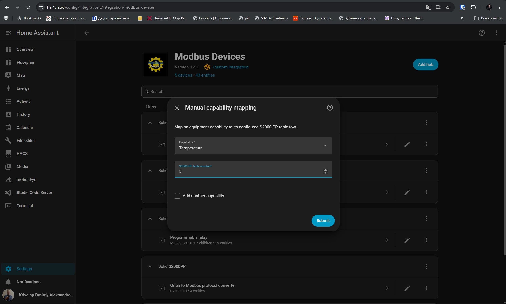</p>

### Одно подключение и несколько downstream devices

Дочерняя Config Entry **не требует и не принимает** отдельные Serial/TCP/UDP-параметры. Она хранит ссылку на выбранную запись С2000-ПП и совместно использует уже открытый сериализованный Modbus-клиент gateway. Для каждого следующего прибора снова выберите **Add hub → Via existing S2000-PP**, укажите тот же gateway и собственные Orion/DPLS identity и mapping.

В результате Home Assistant создаёт отдельные Devices и сущности, но все запросы идут через одно подключение С2000-ПП. Выгрузка дочерней записи не закрывает gateway connection; при выгрузке или удалении самого шлюза его дочерние устройства недоступны до повторной загрузки С2000-ПП.

<p align="center">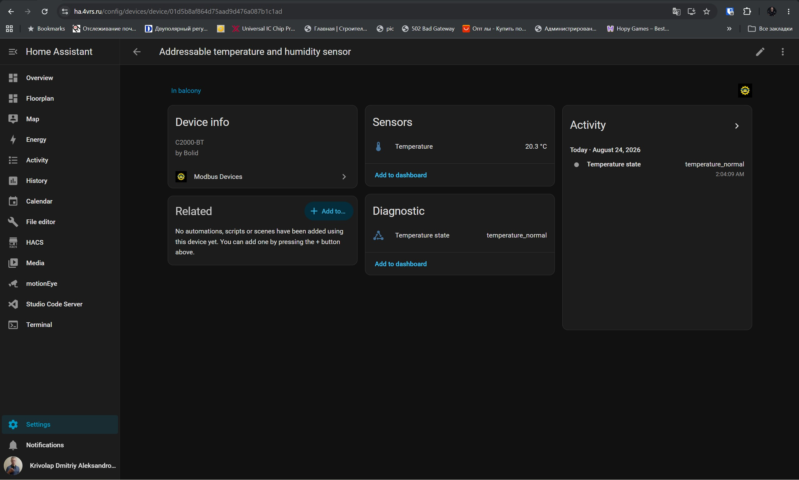</p>

Config Flow локализован на английский и русский языки. Internal class names и register addresses обычно не вводятся пользователем; YAML configuration не поддерживается.

## Modbus RTU over UDP

Production transport поддерживает FC01, FC02, FC03, FC04, FC05, FC06 и FC16. Он использует один persistent UDP socket, фиксированный local UDP port, накопление split datagrams, timeout, CRC validation и проверку source/slave/function. Запросы проходят через ту же per-client serialization, что и у остальных transport types.

Пример (используйте значения из конфигурации своего gateway):

```text
Transport: Modbus RTU over UDP
Remote host: 192.0.2.10
Remote UDP port: 40000
Local UDP port: 40000
Timeout: 3 seconds
Local bind address: 0.0.0.0 (optional)
Downstream device ID: 1
```

Для gateway со static UDP peer локальный UDP port должен совпадать с destination peer port, настроенным в gateway. С2000-Ethernet можно рассматривать как transport gateway для этого режима при настройках «Прозрачный режим», совместимости «Иные приборы» и подходящего UDP peer. Это не equipment class: Home Assistant Device представляет downstream Modbus equipment.

RTU-over-UDP реализован и покрыт автоматизированными тестами. Live packet capture подтвердил правильную передачу raw RTU frame. End-to-end проверка ответа через С2000-Ethernet пока ожидает подтверждения конфигурации gateway, поэтому полная аппаратная совместимость ещё не заявляется.

## Диагностика проблем

- **Не удаётся подключиться:** проверьте host/port или доступность serial device, firewall/routing и соответствие выбранного transport реальному протоколу gateway.
- **Неверный device ID:** укажите downstream Modbus slave/unit ID, а не посторонний адрес gateway.
- **Перепутан UDP:** native Modbus UDP/IP не является raw RTU over UDP; framing должен соответствовать выбранному режиму.
- **Static peer RTU-over-UDP:** destination port в gateway должен совпадать с local UDP port интеграции; optional bind address должен принадлежать хосту Home Assistant.
- **Serial:** проверьте baud rate, byte size, parity, stop bits, проводку и slave ID.
- **Entity стала unavailable после ответа:** timeout, malformed frame, неверный source/slave/function, CRC или payload намеренно отклоняются. Исправьте transport/device configuration; не отключайте validation.

## Установка

Сейчас репозиторий устанавливается как **пользовательский репозиторий HACS** либо вручную. Документация не утверждает, что интеграция включена в HACS Default.

### Пользовательский репозиторий HACS

1. Откройте HACS и диалог пользовательских репозиториев.
2. Добавьте `https://github.com/dk-1983/Modbus_Devices` с категорией **Integration**.
3. Найдите и установите **Modbus Devices**.
4. Перезапустите Home Assistant.
5. Добавьте интеграцию через **Настройки → Устройства и службы**.

Опубликованные пакеты и история версий находятся в [разделе Releases](https://github.com/dk-1983/Modbus_Devices/releases).

### Ручная установка

Скопируйте:

```text
custom_components/modbus_devices
```

в:

```text
/config/custom_components/modbus_devices
```

Перезапустите Home Assistant и добавьте **Modbus Devices** через **Настройки → Устройства и службы**.

## Ограничения и технические границы

- Configuration-assisted mapping ищет настроенные строки С2000-ПП, но не является hardware discovery.
- Видимость через gateway определяет доступные Home Assistant entities: физическая capability может существовать без документированного Modbus path.
- Serial number, firmware, hardware revision, protocol information, radio identifier, RSSI, voltage и другие service values публикуются только тогда, когда текущий transport действительно их предоставляет.
- Radio numeric values реализуются только при подтверждённом актуальной документацией пути через С2000-ПП.
- Исполнения приборов не считаются совместимыми только из-за похожего названия или корпуса.
- Writable frequency setpoint DN310 не реализован.
- Некоторые Bolid relay controls намеренно read-only, если нельзя подтвердить безопасное ownership/tactic поведение.
- RTU-over-UDP RX/end-to-end validation через С2000-Ethernet ещё не завершена.
- Новые equipment models добавляются после проверки актуальных официальных руководств, protocol descriptions, register maps и compatibility information.

Modbus Devices публикует write controls только там, где семантика команды реализована явно. Наличие физического реле само по себе не делает выход writable в Home Assistant.

## Разработка

Реализации оборудования находятся в `custom_components/modbus_devices/equipment/<manufacturer>.py`.

```text
equipment class
  → model capabilities и variants
    → direct I/O либо gateway mappings
      → entity descriptions и snapshots
        → focused и regression tests
```

Одна физическая модель обычно представляется одним equipment class. Небольшие reusable bases содержат общую protocol mechanics, не объединяя разные физические приборы. Изменения по возможности должны сохранять persisted Config Entries, stable device identifiers, entity unique IDs и существующую mapping serialization.

Runtime использует typed `entry.runtime_data`, coordinator-owned polling, grouped reads где они поддерживаются, `SerializedModbusClient` для каждого connection, общую строгую Modbus response validation и explicit manufacturer/equipment registries.

## Проверки качества

Изменения проекта проверяются с помощью:

- pytest, включая focused equipment и regression coverage;
- Home Assistant Hassfest integration validation;
- Ruff correctness checks;
- компиляции Python bytecode и Git whitespace checks.

Количество тестов намеренно не зафиксировано в README, поскольку suite растёт вместе со списком оборудования.

## Ссылки проекта

- [Исходный код](https://github.com/dk-1983/Modbus_Devices)
- [Issues](https://github.com/dk-1983/Modbus_Devices/issues)
- [Releases](https://github.com/dk-1983/Modbus_Devices/releases)
- [Bolid](https://bolid.ru/)
- [Dyna Drive](https://www.dninno.com/)
- [Owen](https://owen.ru/)
- [Лицензия](LICENSE.md)

## Автор

[Дмитрий Криволап](https://4vrs.online)
